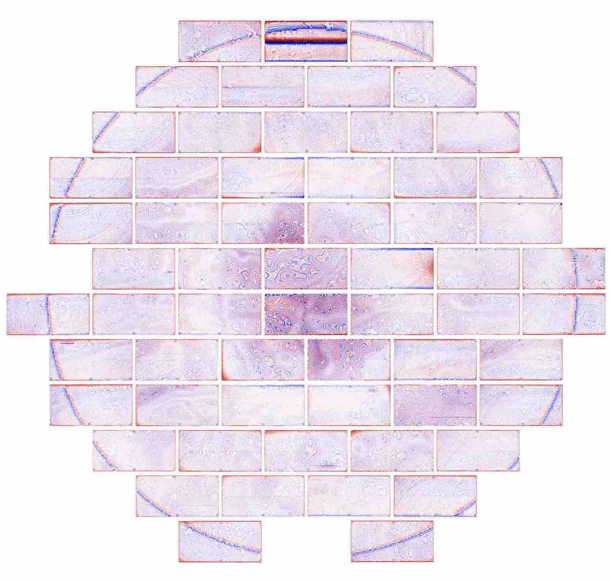
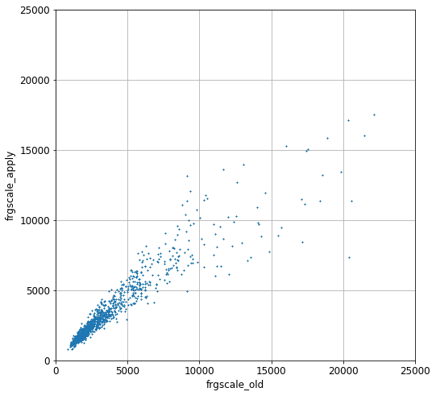

.. title: Fringe correction for DECam z-band
.. slug: fringe
.. tags: 
.. has_math: yes

.. |deg|    unicode:: U+000B0 .. DEGREE SIGN
.. |Prime|    unicode:: U+02033 .. DOUBLE PRIME

.. class:: pull-right well

.. contents::

*Page author and contact:* `Rongpu Zhou`_

.. _`Rongpu Zhou`: ../../contact/#other-experts

A new set of fringe templates was created for DECam :math:`z\hbox{-}\mathrm{band}` images for DR9. This page describes the procedure for generating the templates
and the per-exposure fringe scale factors. These fringe templates and scales replace the fringe correction applied by the `Community Pipeline`_ (henceforth CP) for
`DECaLS`_ imaging in :math:`z\hbox{-}\mathrm{band}` for DR9 of the Legacy Surveys. Specifically, the `CP`_ fringe corrections that are originally applied for all
`DECaLS`_ reductions are backed out and the new fringe corrections are applied. Later versions of the `CP`_ will likely incorporate new fringe templates, and then
the correction described here will no longer be necessary.

.. _`Community Pipeline`: https://legacy.noirlab.edu/noao/staff/fvaldes/CPDocPrelim/PL201_3.html
.. _`CP`: https://legacy.noirlab.edu/noao/staff/fvaldes/CPDocPrelim/PL201_3.html
.. _`DECaLS`: ../../decamls
.. _`DR8`: ../../DR8

Fringe templates
================

The new DR9 :math:`z\hbox{-}\mathrm{band}` fringe templates are generated by median-stacking a large number of images which have known `DR8`_ sources
(blobs) masked and a smooth sky pattern removed.

To decouple the fringe pattern from the much larger-scale sky residual pattern, we remove the latter before stacking. This smooth sky pattern
is computed on a per-night basis, and by masking known sources using the `DR8`_ blob mask and then convolving the masked image with a Gaussian filter of
:math:`\sigma=120\,\mathrm{pixels}`.

About 1400 exposures are used to compute the median-stacked image. A :math:`3\hbox{-}\sigma`
clipping is applied before the median stacking, where :math:`\sigma` denotes the normalized median absolute deviation.

The final fringe template, which is shown below, is smoothed via a Gaussian filter of :math:`\sigma=2` pixels to reduce Poisson noise, and normalized so
that a single fringe scale factor can be applied to all images in a single exposure.

Per-exposure fringe scales
==========================
Preparation for the per-exposure fitting is similar to the fringe template creation. The smooth component of the sky residuals is removed and known sources
are masked. For nights that have insufficient :math:`z\hbox{-}\mathrm{band}` images for stacking to determine the smooth sky pattern, we compute
the smooth sky pattern with a different procedure via spline interpolation [#]_:

- First, the blob-masked and :math:`3\hbox{-}\sigma\hbox{-}\mathrm{clipped}` image is divided into :math:`400\,\mathrm{pixel} \times 400\,\mathrm{pixel}`
  chunks, forming a :math:`4\times9` grid.
- Then, the median in each chunk is used to compute the spline interpolation.

For consistency, the same smooth-sky-removal procedure is also done for the fringe templates. Finally, we perform
a simple linear regression to fit the fringe template to the image. The fringe fitting is done for each CCD, and a single per-exposure median fringe scale is
used for the fringe correction. The new fringe scale is stored in the ``FRGSCNEW`` keyword in the FITS header of the image file.

Special cases
=============
There are several instances for which the new :math:`z\hbox{-}\mathrm{band}` fringe corrections for DR9 required special handling:

- No fringe correction is applied for `DECam CCD`_ ``S7``.
- For `DECam CCD`_ ``S30``:

  * No fringe correction is applied for observations prior to :math:`\mathrm{MJD}=57000` (approximately the year 2014).
  * After :math:`\mathrm{MJD}=57000`, the fringe correction is applied using a per-CCD fringe scale rather than the per-exposure median.

    -  This "fringe" correction mostly accounts for the discontinuity at the amplifier boundary rather than the actual fringe pattern.

- The `DR8`_ blobmask is crucial for adequately masking out sources. For exposures that have fewer than 10 CCDs with available blobmasks we therefore apply the
  original `CP`_ fringe scale along with the new fringe template.

  * A plot is included, below, that compares the original ("old") `CP`_ fringe scale to our corrected fringe scale:

.. _`DECam CCD`: https://noirlab.edu/science/programs/ctio/instruments/Dark-Energy-Camera/characteristics

Code
====
The code that calculates the new fringe templates is `available on GitHub`_.

.. _`available on GitHub`: https://github.com/rongpu/desi-misc/tree/master/ccd_fringe

|

.. [#] These splines are *not* the same as those `used in the Tractor processing`_.

.. _`used in the Tractor processing`: ../files/#splinesky-files-calib-camera-splinesky
