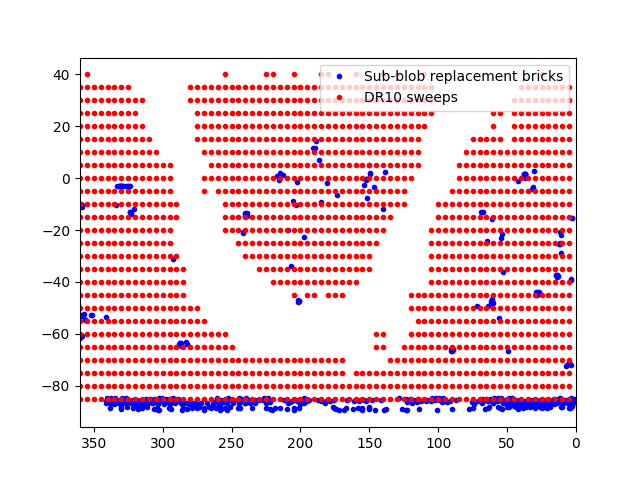

.. title: Known Issues
.. slug: issues
.. tags: 
.. has_math: yes

.. |deg|    unicode:: U+000B0 .. DEGREE SIGN
.. |Prime|    unicode:: U+02033 .. DOUBLE PRIME

.. class:: pull-right well

.. contents::

General Issues
--------------

The most up-to-date issues and in-progress fixes are
available on the GitHub issues pages for the `Legacy Surveys website`_ or the `legacypipe pipeline`_.

Issues with CCDs that may have affected the quality of DECam observations are recorded on the
`DECam CCDs page`_.

.. _`Legacy Surveys website`: https://github.com/legacysurvey/legacysurvey/issues
.. _`legacypipe pipeline`: https://github.com/legacysurvey/legacypipe/issues?q=is:issue+sort:updated-desc
.. _`DECam CCDs page`: https://noirlab.edu/science/programs/ctio/instruments/Dark-Energy-Camera/Status-DECam-CCDs

Header inconsistencies
----------------------
Headers may be inconsistent with catalog values for about 2% of bricks in the `Tractor catalogs`_. This is due to
some files being altered while rsync processes were running.

Duplicate ``ref_id`` values
---------------------------
A very small number of ``ref_id`` values for Gaia sources appear twice in the `Tractor catalogs`_. One of the duplicates corresponds to the
"correct" Gaia source and the second duplicate has all of the correct information for a Gaia source but with an incorrect
``ref_id``. The ``ref_id`` that would be correct for the second duplicate is missing entirely from the `Tractor catalogs`_.

An example from `DR9`_ is ``ref_id`` 303293444934132224, which appears in Tractor catalog ``tractor-0238p302.fits`` with
correct information (RA, Dec, etc.) and in Tractor catalog ``tractor-0238p305.fits`` with information that `actually`
corresponds to the Gaia source with ``ref_id`` 303315950562852864.

The cause of this problem has yet to be fully diagnosed, although the discrepant Gaia sources tend to lie very close to the
boundaries of a brick.

This issue will also propagate to the `sweep files`_.

Bricks where source-fitting failed
----------------------------------
A few dozen bricks were intractable on a reasonable timescale as they overlapped regions of high source density. These
bricks were "bailed out" of before they finished processing. Sources in such bricks can be identified as they have
the ``BAILOUT`` flag set in the `MASKBITS bitmask`_.

In addition, certain high-density regions are missing completely from the Legacy Surveys. A good example is
the `Large Magellanic Cloud`_.

Bricks for which ``SUB_BLOB`` was set
-------------------------------------
To facilitate rapid processing of sources in high-density regions, some DR10 bricks were split into smaller "sub-blobs."
These bricks can be identified as they have ``SUB_BLOB`` set in the `MASKBITS bitmask`_ for some `pixels` in the
`image stacks version`_ of the maskbits product. Due to a bug in processing these sub-blobs, some genuine sources were not
extracted and included in DR10. The locations of the affected 598 bricks are plotted below

These bricks were re-processed in the summer of 2023, effectively fixing the bug, and the DR10 release directory was updated
with the relevant files on the weekend of September 9, 2023.

Files that had to be updated to fix the ``SUB_BLOB`` bug included the `coadd stacks`_, `tractor`_ and tractor-i files, `random catalogs`_,
`sweep files`_, `external-match files`_, and `metric`_ and `log`_ files. The full list of the updated files `is available here`_. The
random catalogs, and the tractor, tractor-i and coadd files were completely replaced, and we recommend always using the latest versions.
The original and updated versions of the sweep and external-match files were both retained. The original versions of the sweeps
are in the directories ``10.0``, ``10.0-extra`` and ``10.0-lightcurves`` and the updated versions are in the directories
``10.1``, ``10.1-extra`` and ``10.1-lightcurves``. The original and updated versions of the external-match files are both in the
``external`` directory, but the original files contain the string `dr10` and the updated files contain the string `dr10.1`.

Large galaxies missing from the Siena Galaxy Atlas
--------------------------------------------------
Fifty-two galaxies were overlooked in the version of the `Siena Galaxy Atlas`_ (SGA) used to process DR10. The upshot of this oversight
is that these galaxies were not flagged as ``GALAXY`` in the `MASKBITS bitmask`_. Further details are provided in `legacypipe issue #680`_.
Note that these fifty-two galaxies `were` included in the publicly released version of the SGA.

.. _`legacypipe issue #680`: https://github.com/legacysurvey/legacypipe/issues/680
.. _`Siena Galaxy Atlas`: ../../sga/sga2020
.. _`Tractor catalogs`: ../catalogs
.. _`tractor`: ../catalogs
.. _`coadd stacks`: ../files/#image-stacks-south-coadd
.. _`sweep files`: ../files/#sweep-catalogs-south-sweep
.. _`random catalogs`: ../files/#random-catalogs-randoms
.. _`image stacks version`: ../files/#image-stacks-south-coadd
.. _`external-match files`: ../files/#external-match-files-south-external
.. _`metric`: ../files/#other-files
.. _`log`: ../files/#other-files
.. _`DR9`: ../../dr9
.. _`MASKBITS bitmask`: ../bitmasks/#maskbits
.. _`Large Magellanic Cloud`: https://www.legacysurvey.org/viewer?ra=80.8916&dec=-69.7567&layer=ls-dr10&zoom=5
.. _`is available here`: ../../files/dr10.1-sub-blob-bricks.txt
