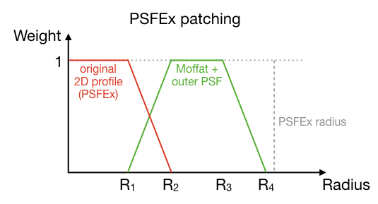
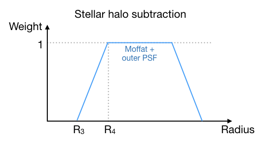
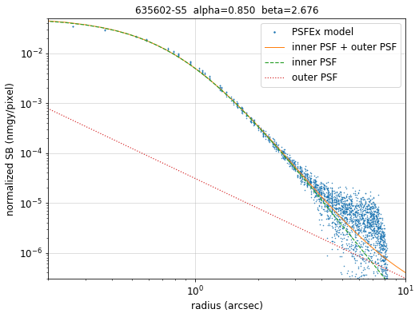
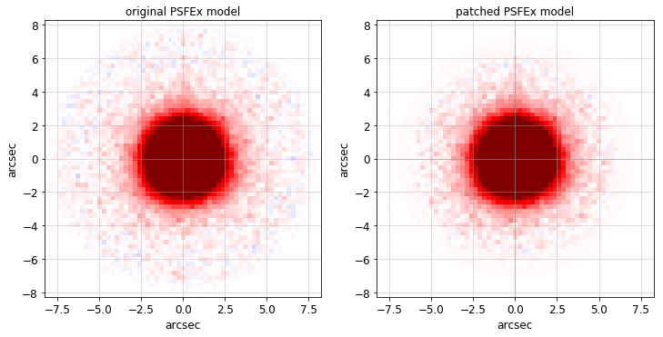
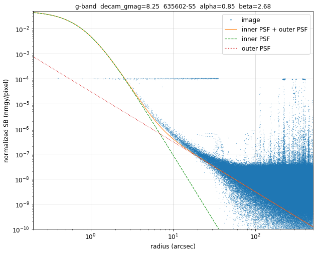
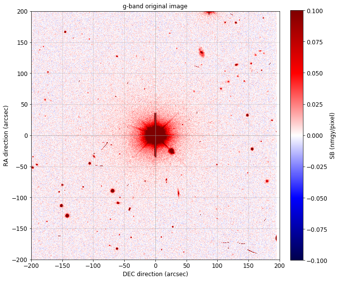
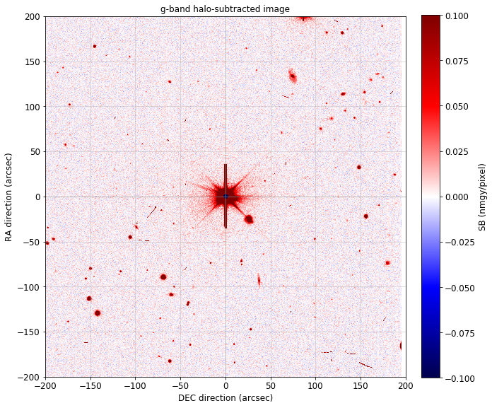

.. title: Modified PSFEx Profile and the Outer Wings of Stars
.. slug: psf
.. tags: 
.. has_math: yes

.. |deg|    unicode:: U+000B0 .. DEGREE SIGN
.. |Prime|    unicode:: U+02033 .. DOUBLE PRIME

.. class:: pull-right well

.. contents::

*Page author and contact:* `Rongpu Zhou`_

.. _`Rongpu Zhou`: ../../contact/#other-experts

Starting with DR9, we use an extended PSF model to subtract the extended wings of bright stars from DECam images for `DECaLS`_. The model is symmetric (which is
a good approximation for DECam images), and is a linear combination of two components:

1. A flexible inner PSF, which is a `Moffat profile`_ fit to the `PSFEx`_ image.
2. A fixed outer PSF, which is either a power law (for :math:`g\hbox{-}` and :math:`r\hbox{-}\mathrm{bands}`) or a `Moffat profile`_ (for :math:`z\hbox{-}\mathrm{band}`).

.. _`Moffat profile`: https://en.wikipedia.org/wiki/Moffat_distribution
.. _`PSFEx`: http://www.astromatic.net/software/psfex

The Inner PSF Profile
=====================
The inner PSF component is a Moffat profile:

- :math:`f_{\mathrm{Moffat}} = \frac{\beta-1}{\pi \alpha^2} \left[1 + \frac{r}{\alpha^2}\right]^{-\beta}`

This formula gives a total flux of unity by definition. Its two free parameters, :math:`\alpha` and :math:`\beta`, are obtained by fitting to
the `PSFEx`_ image of each CCD. Only `PSFEx`_ pixels between 1.8 and 5 arcsec in radius are used in the fit.

The size of the DECam `PSFEx`_ image is only ~8.1 arcsec in radius, too small for implementing the extended PSF model. Nevertheless, we
modify the the `PSFEx`_ image for the following reasons:

1. It removes discontinuities when we subtract the outer wings of bright stars from the images
2. The noisy parts of the `PSFEx`_ images are replaced by a noiseless model PSF. This is more of a cosmetic improvement and it should not
   affect the *Tractor* fitting of unsaturated stars or faint galaxies.

Here are illustrations of the weights for patching the `PSFEx`_ image and the weights of the stellar halo subtraction:

The (tentative) :math:`R` values are :math:`R_1, R_2, R_3, R_4 = 5.0, 6.0, 7.0, 8.0\,(\mathrm{arcsec}`). The transition radii :math:`R_1` and :math:`R_2` are chosen so
that beyond radius :math:`R_1` there is little asymmetry in the `PSFEx`_ model (*i.e.* the symmetric `Moffat profile`_ is a good approximation).
For reference, the size of the `PSFEx`_ images is ~8.1 arcsec in radius (:math:`63 \times 63` with pixel size :math:`0.262\,\mathrm{arcsec}`) for DECam
and Mosaic, and ~6.8 arcsec (:math:`31 \times 31` with pixel size :math:`0.454\,\mathrm{arcsec}`) for 90Prime.

In the patched `PSFEx`_ image (the first eigen-image), the crossover between :math:`R_1` and :math:`R_2` marks the transition between the `PSFEx`_
image and the model PSF. The flux gradually approaches zero between :math:`R_3` and :math:`R_4`, and is strictly zero beyond :math:`R_4`. For the
other eigenimages, the values for each pixel gradually approach zero between :math:`R_1` and :math:`R_2` (*i.e.* the red curve in the above plot),
and they are strictly zero beyond :math:`R_2`. To preserve continuity, the outer PSF component is included for `PSFEx`_ patching, even though it's
not used in the fitting; it contributes a negligible fraction of the flux in the `PSFEx`_ image.

Here is an example of the `Moffat profile`_ fit to the `PSFEx`_ image, and the corresponding original and patched `PSFEx`_ image:

The Outer PSF Profile
=====================

For :math:`g\hbox{-}` and :math:`r\hbox{-}\mathrm{bands}`, the outer PSF profile is a fixed power law (normalized to a 22.5 magnitude star, in units
of :math:`\mathrm{nanomaggies}/\mathrm{arcsec}^2`):

- :math:`f_g = 0.00045 r^{-2}`
- :math:`f_r = 0.00033 r^{-2}`

For :math:`z\hbox{-}\mathrm{band}`, the outer PSF is a weighted `Moffat profile`_. For most CCDs, the Moffat parameters (with radius in arcsec and surface
brightness in :math:`\mathrm{nanomaggies}/\mathrm{arcsec}^2`) and the weights are (for a 22.5 magnitude star):

- :math:`[\alpha, \beta, weight] = [17.650, 1.7, 0.0145]`

However, a small subset of DECam CCDs (N20, S8, S10, S18, S21 and S27) have a more compact outer PSF in the :math:`z\hbox{-}\mathrm{band}`, which is characterized using:

- :math:`[\alpha, \beta, weight] = [16, 2.3, 0.0095]`

The Combined PSF model
======================

Below is an example of the model PSF profile in :math:`g\hbox{-}\mathrm{band}`, with the pixel fluxes around a bright star overplotted. The inner PSF's are obtained
by fitting the `PSFEx`_ image, and the outer PSF profile is fixed and normalized to a DECam magnitude `predicted from Gaia magnitudes and colors`_.
Also included are the corresponding original and halo-subtracted images.

CCD-to-CCD variations in :math:`z\hbox{-}\mathrm{band}`
=======================================================

A surprising finding from this work is that a small subset of DECam CCDs have different PSFs compared to the other CCDs in the :math:`z\hbox{-}\mathrm{band}`. These outlier CCDs
have consistently more compact PSFs at the :math:`r>\sim20\,\mathrm{arcsec}` scale, and they can be approximated by a different `Moffat profile`_. In `DECaLS`_, this
difference only shows up in the :math:`z\hbox{-}\mathrm{band}` images (although it's possible that such CCD-to-CCD variations might also appear in, *e.g.*,
:math:`i\hbox{-}\mathrm{band}` or :math:`Y\hbox{-}\mathrm{band}` images from DECam). The cause of these variations is unclear.

File locations
==============
The `PSFEx`_ files used in this analysis are available in the following directories at NERSC:

XXX DR10 updates?

- Original PSF: ``/global/cfs/cdirs/cosmo/work/legacysurvey/dr9-archive/unpatched-psfex``
- Patched PSF: ``/global/cfs/cdirs/cosmo/data/legacysurvey/dr9/calib/psfex``

.. _`DECaLS`: ../../decamls

Code
====
The code used to analyze the DECam PSF for the Legacy Surveys is:

- `PSF patching`_
- `Halo subtraction`_
- `Polynomial coefficients to transform Gaia to DECam`_

.. _`PSF patching`: https://github.com/legacysurvey/legacypipe/blob/a7a6c6d37d1ad275130fc6d0cec867bc072949dc/py/legacyzpts/modify_psfex_profiles.py
.. _`Halo subtraction`: https://github.com/legacysurvey/legacypipe/blob/91729af6c40216aaae8315500e7a4c63e84bf974/py/legacypipe/halos.py
.. _`Polynomial coefficients to transform Gaia to DECam`: https://github.com/legacysurvey/legacypipe/blob/91729af6c40216aaae8315500e7a4c63e84bf974/py/legacypipe/reference.py#L160
.. _`predicted from Gaia magnitudes and colors`: https://github.com/legacysurvey/legacypipe/blob/91729af6c40216aaae8315500e7a4c63e84bf974/py/legacypipe/reference.py#L160

Additional Information
======================
Further extensive tests and plots characterizing the `DECaLS`_ PSF model *for DR9*  is available for DESI collaborators `on the wiki`_.

.. _`on the wiki`: https://desi.lbl.gov/trac/wiki/DecamLegacy/DR9/PSFExAndOuterWings
