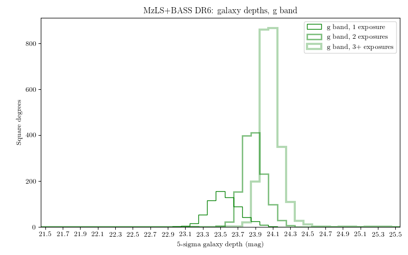
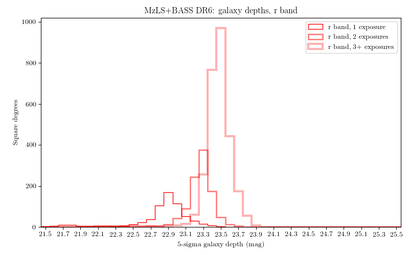
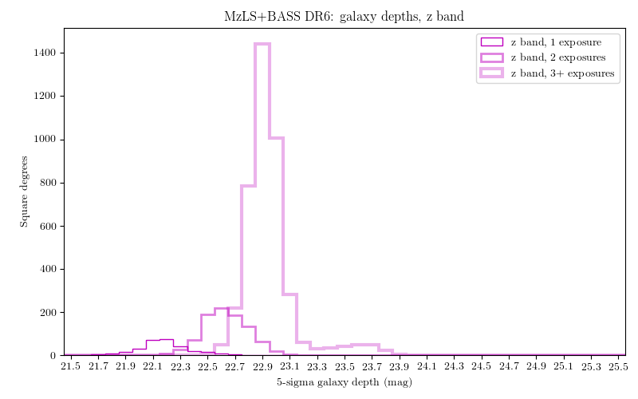

.. title: Data Release Description
.. slug: description
.. tags: 
.. has_math: yes

.. |sigma|    unicode:: U+003C3 .. GREEK SMALL LETTER SIGMA
.. |sup2|     unicode:: U+000B2 .. SUPERSCRIPT TWO
.. |alpha|      unicode:: U+003B1 .. GREEK SMALL LETTER ALPHA
.. |chi|      unicode:: U+003C7 .. GREEK SMALL LETTER CHI
.. |delta|    unicode:: U+003B4 .. GREEK SMALL LETTER DELTA
.. |deg|    unicode:: U+000B0 .. DEGREE SIGN
.. |times|  unicode:: U+000D7 .. MULTIPLICATION SIGN
.. |plusmn| unicode:: U+000B1 .. PLUS-MINUS SIGN
.. |Prime|    unicode:: U+02033 .. DOUBLE PRIME
.. |geq|    unicode:: U+02265 .. GREATER THAN OR EQUAL TO

.. class:: pull-right well

.. contents::

The Legacy Surveys are producing an inference model of the 14,000 square degrees
of extragalactic sky visible from the northern hemisphere in three optical bands
(:math:`g,r,z`) and four infrared bands.  The sky coverage is approximately bounded by
-18\ |deg| < |delta| < +84\ |deg| in celestial coordinates and :math:`|b|` > 18\
|deg| in Galactic coordinates. To achieve this goal, the Legacy Surveys are conducting
3 imaging projects on different telescopes, described in more depth at the following links:

========================================== ===================================== ===========================================
*The Beijing-Arizona Sky Survey* (`BASS`_) *The DECam Legacy Survey* (`DECaLS`_) *The Mayall z-band Legacy Survey* (`MzLS`_)
========================================== ===================================== ===========================================

.. _`BASS`: ../../bass
.. _`DECaLS`: ../../decamls
.. _`MzLS`: ../../mzls
.. _`Tractor`: https://github.com/dstndstn/tractor
.. _`NOIRLab Community Pipeline`: https://legacy.noirlab.edu/noao/staff/fvaldes/CPDocPrelim/PL201_3.html
.. _`Ceres solver`: http://ceres-solver.org
.. _`SciPy`: https://www.scipy.org
.. _`mixture-of-gaussian`: https://arxiv.org/abs/1210.6563
.. _`SFD98`: https://ui.adsabs.harvard.edu/abs/1998ApJ...500..525S/abstract
.. _`recommended conversions by the WISE team`: http://wise2.ipac.caltech.edu/docs/release/allsky/expsup/sec4_4h.html#conv2ab
.. _`Gaia Data Release 1`: https://gaia.esac.esa.int/documentation/GDR1/index.html
.. _`DR7`: ../../dr7
.. _`DR5`: ../../dr5
.. _`DR4`: ../../dr4
.. _`DR3`: ../../dr3
.. _`DR2`: ../../dr2
.. _`DESI`: https://desi.lbl.gov
.. _`status page`: ../../status
.. _`HEALPixels`: https://healpix.jpl.nasa.gov

Contents of DR6
===============

Data Release 6 (DR6) is the sixth public data release of the Legacy Surveys. It is the
second public release of images and catalogs that combine the Beijing-Arizona Sky Survey
and the Mayall z-band Legacy Survey (`BASS`_ and `MzLS`_; `DR5`_ comprised the fourth
release of data from `DECaLS`_). Imaging from the Legacy Surveys is first reduced
through the `NOIRLab Community Pipeline`_ before being processed using the `Tractor`_.

DR6 includes `BASS`_ images taken prior to June 25, 2017 and `MzLS`_ images taken
prior to December 9, 2017. For the latest `DECaLS`_ images, see `DR5`_ of the Legacy
Surveys. The `BASS`_ and `MzLS`_ data in DR6 are reduced in a manner that is largely
consistent with `DECaLS`_ reductions in `DR5`_.

The table below indicates the area covered in DR6 for different
numbers of passes and in different filters.
These are precise area estimates derived from the geometry of
CCDs that contribute to the Legacy Surveys footprint.

===================== ========= ========= =========
Band/Number of Passes |geq| 1   |geq| 2   |geq| 3
===================== ========= ========= =========
:math:`g`-band        4380 |d2| 3708 |d2| 2376 |d2|
:math:`r`-band        4374 |d2| 3719 |d2| 2649 |d2|
:math:`z`-band        5231 |d2| 4853 |d2| 3622 |d2|
All bands jointly     3823 |d2| 3110 |d2| 1441 |d2|
===================== ========= ========= =========

.. |d2| replace:: deg\ :sup:`2`

DR6 includes the stacked images and the Tractor-based catalogs.
The size of the DR6 data distribution is:

========== ============ =======================
Size*       Directory    Description
========== ============ =======================
30 GB      `calib/`_    Calibration files
9.0 TB     `coadd/`_    Co-added images, including |chi|\ |sup2|, depth, image, model, nexp, and Quality Assurance PNG plots
8.8 GB     `external/`_ Matches to other catalogs (SDSS, etc.)
1.9 GB     `gallery/`_  Images of notable galaxies (NGC, etc.)
22 GB      `logs/`_     Log files generated by Tractor processing
182 GB     `metrics/`_  Metrics
147 GB     `sweep/`_    Repackaged versions of the Tractor catalogs
449 GB     `tractor/`_  Tractor catalogs
========== ============ =======================

\*Note that although the *contents* of a directory should be fixed for each Data Release,
the *size* of a directory can change. This is typically due to updated file compression.
So, the listed directory sizes should be viewed as (very reasonable) estimates.

.. _`calib/`: https://portal.nersc.gov/cfs/cosmo/data/legacysurvey/dr6/calib/
.. _`coadd/`: https://portal.nersc.gov/cfs/cosmo/data/legacysurvey/dr6/coadd/
.. _`external/`: https://portal.nersc.gov/cfs/cosmo/data/legacysurvey/dr6/external/
.. _`gallery/`: https://portal.nersc.gov/cfs/cosmo/data/legacysurvey/dr6/gallery/
.. _`logs/`: https://portal.nersc.gov/cfs/cosmo/data/legacysurvey/dr6/logs/
.. _`metrics/`: https://portal.nersc.gov/cfs/cosmo/data/legacysurvey/dr6/metrics/
.. _`sweep/`: https://portal.nersc.gov/cfs/cosmo/data/legacysurvey/dr6/sweep/
.. _`tractor/`: https://portal.nersc.gov/cfs/cosmo/data/legacysurvey/dr6/tractor/

For all of the Legacy Surveys, including `BASS`_ and `MzLS`_, co-added images and
`Tractor`_ catalogs are presented in "bricks" of approximate
size 0.25\ |deg| |times| 0.25\ |deg|.  Each brick is defined in terms of a box in RA,Dec
coordinates.  For the image stacks, we use a simple tangent-plane (WCS TAN)
projection around the brick center. The projections for the :math:`g,r,z` filters are identical.
There are 662,174 bricks spread over the sky, meaning that each brick has an average
area of 0.0623 deg\ :sup:`2`\ . The brick images have some overlap.
The co-added images should be
used with caution, as noted below in the *Image Stacks* section.

There are approximately 310 million unique sources in DR6 spread over 92,287 bricks.

Obtaining Images and Raw Data
==============================

Images from all 3 of the Legacy Surveys can be viewed directly using
`the Sky viewer`_ and raw data can be obtained through `the NOIRLab portal`_
(see also the information near the bottom of the `files`_ page).

Sections of the coadd images in DR6 can be obtained as JPEGs or FITS files using
the cutout service, as follows:

JPEG: https://www.legacysurvey.org/viewer/jpeg-cutout?ra=154.7709&dec=46.4537&layer=mzls+bass-dr6&pixscale=0.262

FITS: https://www.legacysurvey.org/viewer/fits-cutout?ra=154.7709&dec=46.4537&layer=mzls+bass-dr6&pixscale=0.262&bands=grz

where :math:`bands` is a string such as ":math:`grz`",":math:`gz`",":math:`g`", etc.

Replacing `layer=mzls+bass-dr6` with `layer=mzls+bass-dr6-model` or `layer=mzls+bass-dr6-resid` will instead return
cutouts for the model and residual images, respectively.

The size of the image can also be specified using :math:`width`, :math:`height` and :math:`size`,
where :math:`size` forces :math:`width` and :math:`height` to be equal. For example:

https://www.legacysurvey.org/viewer/jpeg-cutout?ra=154.7709&dec=46.4537&width=100&layer=mzls+bass-dr6&pixscale=0.262

https://www.legacysurvey.org/viewer/jpeg-cutout?ra=154.7709&dec=46.4537&height=100&layer=mzls+bass-dr6&pixscale=0.262

https://www.legacysurvey.org/viewer/jpeg-cutout?ra=154.7709&dec=46.4537&size=100&layer=mzls+bass-dr6&pixscale=0.262

It is possible to retrieve multiple cutouts from the command line using standard utilites such as `wget`_.

As of the writing of this documentation the maximum size for cutouts (in number of pixels) is 3000.
Pixscale=0.262 (arcseconds per pixel) will return (approximately) the pixel scale used in
the coadds.  The native pixel scale of the Mosaic camera (used for :math:`z` band) is
approximately 0.262, and for the 90prime camera (used for :math:`g` and :math:`r` bands)
it is approximately 0.454.
For information on how to recover `DECaLS`_ cutouts, see the `DR7 description`_ page.

See also the `list of URL/cutout patterns that are supported by the viewer`_.

.. _`list of URL/cutout patterns that are supported by the viewer`: https://www.legacysurvey.org/viewer/urls
.. _`wget`: https://www.gnu.org/software/wget/manual/wget.html#Overview
.. _`DR5 description`: ../../dr5/description
.. _`DR7 description`: ../../dr7/description
.. _`files`: ../files
.. _`the Sky viewer`: https://www.legacysurvey.org/viewer
.. _`the NOIRLab portal`: https://astroarchive.noirlab.edu/portal/search/

Source Detection
================

The source detection uses a PSF- and SED-matched-filter detection on
the stacked images, with a 6\ |sigma| detection limit.
The `Tractor`_ fitting step is initialized with these positions, although
these positions can be changed during the fits and
low-S/N sources can be removed.

For source detection, each image is convolved by its PSF model, then a weighted stack
of these is created in order to optimize the point-source detection
efficiency.  Next, SED-matched combinations of the three bands are
created, for two SEDs: "flat" (a source with AB color zero), and
"red", a source with AB color :math:`g-r = 1`, :math:`r-z = 1`.  Sources above 6\ |sigma|
are detected in each of these two SED-matched filters, as well as in each band independently.

As of `DR5`_, source detection is run first in :math:`z`, then in :math:`r`, :math:`g`, "flat"
and finally in "red". In `DR4`_, `DR3`_ and earlier data releases,
source detection was run first in :math:`g`, then in :math:`r`, :math:`z`, "flat"
and finally in "red".

PSF
===

The `Tractor`_ makes use of the PSF on each individual exposure. The PSF for
the individual exposures are first computed independently for each CCD
using `PSFEx`_, generating spatially-varying pixelized models.

The configuration files for SExtractor and `PSFEx`_ that we used for a given
iteration of our codebase are available `on our github page`_.

.. _`PSFEx`: http://www.astromatic.net/software/psfex
.. _`on our github page`: https://github.com/legacysurvey/legacypipe-dir/tree/master/calib/se-config

Sky Level
=========

The Community Pipeline removes a sky level that includes a sky pattern, an illumination
correction, and a single scaled fringe pattern. These steps are described on the
`NOIRLab Community Pipeline`_ page. This makes the sky level in the processed images near
zero, and removes most pattern artifacts. A constant sky level is then added back to the
image that is the mean of what was removed.

Additionally, we compute and remove a spatially varying (spline) sky
model, by detecting and masking sources, then computing medians in
sliding 512-pixel boxes.

Tractor Catalogs
================

The `Tractor`_ code runs within the geometrical region
of a brick. This fitting is performed on the individual exposures
that overlap the brick, without making use of the image stacks.
This preserves the full information content of the data set in the fits,
handles masked pixels without the need for uncertain interpolation techniques,
and fits to data points without the complication of pixel covariances.

Morphological Classification
============================

The `Tractor`_ fitting can allow any of the source properties or
image calibration parameters (such as the PSF) to float.
Only the source properties were allowed to float in DR6.
These are continuous properties for the object centers, fluxes,
and the shape parameters.

There is also the discrete choice of which
model type to use. In DR6, five morphological types are used: point sources,
round exponential galaxies with a variable radius ("REX"), deVaucouleurs profiles
(elliptical galaxies), exponential profiles (spiral galaxies), and composite
profiles that are deVaucouleurs + exponential (with the same source center).
The total numbers of the different morphological types in DR6 are:

================= ==================
Number of Sources Primary Objects of Type
================= ==================
   313,512,903    *All*
   121,854,427    ``PSF``
   139,736,335    ``REX``
    26,804,729    ``EXP``
    22,741,635    ``DEV``
     2,375,777    ``COMP``
================= ==================

Note that, as of `DR5`_, the "REX" model replaced the "SIMP" model used in
`DR4`_, `DR3`_ and earlier data releases.

The decision to retain an object in the catalog and to re-classify it using
models more complicated than a point source is made using the penalized
changes to |chi|\ |sup2| in the image after subtracting the models for other sources.
The "PSF" and "REX" models are computed for every source and the better of these
two is used when deciding whether to keep the source. A source is retained if its
penalized |chi|\ |sup2| is improved by 25; this corresponds to a |chi|\ |sup2|
difference of 27 (because of the penalty of 2 for the source centroid). Sources
below this threshold are removed.

The source is classified as the better of "point source (PSF)" or "round exponential
galaxy (REX)" unless the penalized |chi|\ |sup2| is improved by 9 (*i.e.*,
approximately a 3\ |sigma| improvement) by treating it as a deVaucouleurs or
exponential profile. The classification is a composite of deVaucouleurs + exponential
if it is both a better fit to a single profile over the point source, and the composite
improves the penalized |chi|\ |sup2| by another 9. These choices implicitly mean
that any extended source classifications have to be at least 5.8\ |sigma| detections
and that composite profiles must be at least 6.5\ |sigma| detections.

The fluxes are not constrained to be positive-valued.  This allows the fitting of
very low signal-to-noise sources without introducing biases at the faint end.  It
also allows the stacking of fluxes at the catalog level.

Tractor Implementation Details
==============================

`Tractor`_ fundamentally treats the fitting as a |chi|\ |sup2| minimization
problem.  The current core routine uses the sparse least squares
solver from the `SciPy`_ package, or the open source
`Ceres solver`_, originally developed by Google.

The galaxy profiles (the exponential and deVaucouleurs profiles mentioned above
under *Morphological Classification*) are approximated with `mixture-of-gaussian`_
(MoG) models and are convolved by the pixelized PSF models using a new
Fourier-space method (Lang, in prep).
The galaxy profile approximation introduces errors in these
models typically at the level of :math:`10^{-4}` or smaller.
The PSF models are treated as pixel-convolved quantities,
and are evaluated at the integral pixel coordinates without integrating
any functions over the pixels.

The Tractor algorithm could be run with both the source parameters
and the calibration parameters allowed to float, at the cost of
more compute time and the necessity to use much larger blobs because
of the non-locality of the calibrations.  A more practical approach
would be to iterate between fitting source parameters in brick space,
and fitting calibration parameters in exposure space.  Such iterations
will be considered and tested for future data releases.
Another practical issue is that the current PSF models may allow
too much freedom.

Photometry
==========

The flux calibration for `BASS`_ and `MzLS`_ are on the AB natural system of the `90Prime`_
and `Mosaic-3`_ cameras, respectively.
An AB system reports the same flux in any band for a source whose spectrum is
constant in units of erg/s/cm\ |sup2|/Hz. A source with a spectrum of
:math:`f = 10^{-(48.6+22.5)/2.5}` erg/s/cm\ |sup2|/Hz
would be reported to have an integrated flux of 1 nanomaggie in any filter.
The natural system means that we have not
applied color terms to any of the photometry, but report fluxes as observed in the
`90Prime`_ and `Mosaic-3`_ filter systems.

Zero point magnitudes for the CP reductions of the `90Prime`_ and `Mosaic-3`_ images
were computed by comparing Legacy Survey PSF photometry to
`Pan-STARRS-1 (PS1) PSF photometry`_, where the latter was modified with color terms
to place the PS1 photometry on the `90Prime`_ and `Mosaic-3`_ camera systems.
The same color terms are applied to all CCDs.
Zero points are computed separately for each CCD, but not for each amplifier.
The *average* color terms to convert from PS1 to `90Prime`_ (for `BASS`_) and
`Mosaic-3`_ (for `MzLS`_)  were computed for stars
in the color range :math:`0.4 < (g-i) < 2.7` as follows:

.. math::
               (g-i) & = & g_{\mathrm{PS}} - i_{\mathrm{PS}} \\
   g_{\mathrm{BASS}} & = & g_{\mathrm{PS}} + 0.06630 (g-i) + 0.00958 (g-i)^2 - 0.00672 (g-i)^3 \\
   r_{\mathrm{BASS}} & = & r_{\mathrm{PS}} - 0.04836 (g-i) + 0.01100 (g-i)^2 - 0.00563 (g-i)^3 \\
   z_{\mathrm{MzLS}} & = & z_{\mathrm{PS}} - 0.12315 (g-i) + 0.04608 (g-i)^2 - 0.01164 (g-i)^3 \\

The brightnesses of objects are all stored as linear fluxes in units of nanomaggies.  The
conversion from linear fluxes to magnitudes is :math:`m = 22.5 - 2.5 \log_{10}(\mathrm{flux})`.
These linear fluxes are well-defined even at the faint end, and the errors on the linear
fluxes should be very close to a normal distribution.  The fluxes can be negative for faint
objects, and indeed we expect many such cases for the faintest objects.

.. _`Pan-STARRS-1 (PS1) PSF photometry`: https://ui.adsabs.harvard.edu/abs/2016ApJ...822...66F/abstract

The filter curves are available for `BASS g-band`_, `BASS r-band`_, `MzLS z-band`_ and
`MzLS z-band with corrections`_ for the telescope, corrector, camera and atmosphere
(at airmass=1.0).
The BASS filter responses are described in Section 2.2 of the `BASS project overview paper`_. The
`BASS`_ filter curves were updated during the `DR7`_ release, but the `old filter curve for BASS g-band`_
and `old filter curve for BASS r-band`_ (circa DR5) are still available.

As of DR6, PSF photometry uses the same PSF models
(and sky background subtraction) for zeropoint-fitting as is later used in cataloging.
This was not the case for `DR5`_ or before.
So, starting with DR6, the measured fluxes for PS1 stars should be completely self-consistent.

DR6 also contains WISE fluxes force-photometered at the position of Legacy Survey sources.
The WISE Level 1 images and the unWISE image stacks are on a Vega system.
We have converted these to an AB system using the `recommended conversions by
the WISE team`_. Namely,
:math:`\mathrm{Flux}_{\mathrm{AB}} = \mathrm{Flux}_{\mathrm{Vega}} * 10^{-(\Delta m/2.5)}`
where :math:`\Delta m` = 2.699, 3.339, 5.174, and 6.620 mag in the W1, W2, W3 and W4 bands.
For example, a WISE W1 image should be multiplied by :math:`10^{-2.699/2.5} = 0.083253` to
give units consistent with the Tractor catalogs. These conversion factors are recorded in the
Tractor catalog headers ("WISEAB1", etc). The result is that the optical and WISE fluxes
we provide should all be within a few percent of being on an AB system.

.. _`BASS project overview paper`: https://ui.adsabs.harvard.edu/abs/2017PASP..129f4101Z/abstract
.. _`BASS g-band`: ../../files/BASS_g_corr.bp
.. _`BASS r-band`: ../../files/BASS_r_corr.bp
.. _`old filter curve for BASS g-band`: ../../files/bass-g.txt
.. _`old filter curve for BASS r-band`: ../../files/bass-r.txt
.. _`MzLS z-band`: ../../files/kpzd.txt
.. _`MzLS z-band with corrections`: ../../files/kpzdccdcorr3.txt
.. _`Mosaic-3`: https://noirlab.edu/science/programs/kpno/retired-instruments/mosaic
.. _`90Prime`: https://soweb.as.arizona.edu/~tscopewiki/doku.php?id=90prime_info
.. _`DR8 catalogs`: ../../dr8/catalogs/#galactic-extinction-coefficients

Galactic Extinction
===================

The most recent values of the Galactic extinction coefficients are available on the `DR8 catalogs`_ page.

Astrometry
==========

Our astrometry uses the `Gaia Data Release 1`_ system. Positions of sources are tied to
predicted Gaia positions at the epoch of the corresponding Legacy Survey observation. The
residuals are typically smaller than |plusmn|\ 0.03\ |Prime|.

Astrometric calibration of all optical Legacy Survey data is conducted using Gaia
astrometric positions of stars matched to Pan-STARRS-1 (PS1).
The same matched objects are used for both astrometric and photometric calibration. There
are some areas of sky where Gaia has "holes," i.e., where stars brighter than the Gaia
magnitude limit are missing from the Gaia catalog. As a result, in
some regions of the survey there are fewer matches to a given bright magnitude limit in
the PS1-Gaia catalog than there are in the PS1 catalog that was used for astrometric
calibration in, e.g., `DR4`_ of the Legacy Surveys.

As of DR6, PSF photometry uses the same PSF models
(and sky background subtraction) for zero-point-fitting as is later used in cataloging.
This was not the case for `DR5`_ or before.
So, starting with DR6, the measured positions for Gaia stars should be completely
self-consistent, substantially reducing any systematic errors in astrometry.

Image Stacks
============

The image stacks are provided for convenience, but were not used in the Tractor fits.
These images are oversized by approximately 260 pixels in each dimension. These are
tangent projections centered at each brick center, North up, with dimensions of
3600 |times| 3600 and a scale of 0.262\ |Prime|/pix.  The image stacks are computed
using Lanczos-3 interpolation. These stacks should not be used for "precision" work.

Depths
======

The histograms below depict the median 5\ |sigma| (AB) depths for *galaxies* in areas with
different numbers of observations in DR6.

These histograms are based upon the formal errors in the Tractor
catalogs for point sources, which need further confirmation. These depths can be compared
to the predicted proposed depths for 2 observations at 1.5\ |Prime| seeing of
:math:`g=24.7`, :math:`r=23.9`, :math:`z=23.0`.

Code Versions
=============

* `desiconda/20170818-1.1.12-img` was used, except for the following three packages, for which a local build was created to bypass the desiconda build:

  - `fitsio <https://github.com/esheldon/fitsio>`_: git commit 844055b00de464ed87e1e7560d9e9c2a2e4dc138, tag v0.9.12rc1-21-g844055b
  - `Astrometry.net <https://github.com/dstndstn/astrometry.net>`_: git commit: a5cb17a742cf0e66e5d0e09675b8c7e614aabcb9, tag 0.73-1-ga5cb17a
  - `Tractor  <https://github.com/dstndstn/tractor>`_: git commit bc042691d58f6d684642cade435bdd2eff3a241e, tag dr6.2

* `LegacyPipe <https://github.com/legacysurvey/legacypipe>`_ was upgraded twice to fix small bugs, but the bulk of the processing was done with the first version:

  - git commit 02a4d874a957c66da8d4a9b079299f74c9456a53, tag dr6.rc1
  - git commit 536e466dbb0d022e767835810858a50ffe0fe0fc, tag dr6.rc1.1
  - git commit 1b741bbd35e30d16f4d56ef673d3583baa335645, tag dr6.rc1.2

* Note that Brick `1228p810` was processed with a different stack: `desiconda 20170719-1.1.9-imaging`, `legacypipe dr6.rc1.1-18-g80be603`
* NOIRLab Community Pipeline: mixture of versions; recorded as ``PLVER``

.. _`Legacy Survey Data Release 2`: ../../dr2
.. _`Legacy Survey Data Release 3`: ../../dr3
.. _`Legacy Survey Data Release 4`: ../../dr4
.. _`Legacy Survey Data Release 5`: ../../dr5

Glossary
========

BASS
    `Beijing-Arizona Sky Survey <https://www.legacysurvey.org/bass>`_.

Blob
    Continguous region of pixels above a detection threshold and neighboring
    pixels; Tractor is optimized within blobs.

Brick
    A region bounded by lines of constant RA and DEC; reductions
    are performed within bricks of size approximately 0.25\ |deg| |times| 0.25\ |deg|.

CP
    Community Pipeline (reduction pipeline operated by NOIRLab;
    https://legacy.noirlab.edu/noao/staff/fvaldes/CPDocPrelim/PL201_3.html).

DECaLS
    `Dark Energy Camera Legacy Survey <https://www.legacysurvey.org/decamls>`_.

DR2
    `Legacy Survey Data Release 2`_.

DR3
    `Legacy Survey Data Release 3`_.

DR4
    `Legacy Survey Data Release 4`_.

DR5
    `Legacy Survey Data Release 5`_.

DECam
    Dark Energy Camera on the Blanco 4-meter telescope.

maggie
    Linear flux units, where an object with an AB magnitude of 0 has a
    flux of 1.0 maggie.  A convenient unit is the nanomaggie: a flux of 1 nanomaggie
    corresponds to an AB magnitude of 22.5.

MoG
    Mixture-of-gaussian model to approximate the galaxy models (https://arxiv.org/abs/1210.6563).

MzLS
    `Mayall z-band Legacy Survey <https://www.legacysurvey.org/mzls>`_.

NOIRLab
    `The NSF's National Optical-Infrared Astronomy Research Laboratory  <https://www.aura-astronomy.org/centers/nsfs-oir-lab>`_.

nanomaggie
    Linear flux units, where an object with an AB magnitude of 22.5 has a flux
    of :math:`1 \times 10^{-9}` maggie or 1.0 nanomaggie.

PSF
    Point spread function.

PSFEx
    `Emmanuel Bertin's PSF fitting code <http://www.astromatic.net/software/psfex>`_.

SDSS
    `Sloan Digital Sky Survey <https://www.sdss.org>`_.

SDSS DR12
    `Sloan Digital Sky Survey Data Release 12 <https://www.sdss.org/dr12/>`_.

SDSS DR13
    `Sloan Digital Sky Survey Data Release 13 <https://www.sdss.org/dr13/>`_.

SED
    Spectral energy distribution.

SourceExtractor
    `Source Extractor reduction code <http://www.astromatic.net/software/sextractor>`_.

SFD98
    Schlegel, Finkbeiner & Davis 1998 extinction maps (https://ui.adsabs.harvard.edu/abs/1998ApJ...500..525S/abstract).

Tractor
    `Dustin Lang's inference code <https://github.com/dstndstn/tractor>`_.

unWISE
    New coadds of the WISE imaging, at original full resolution
    (http://unwise.me, https://arxiv.org/abs/1405.0308).

WISE
    `Wide Infrared Survey Explorer <http://wise.ssl.berkeley.edu>`_.
