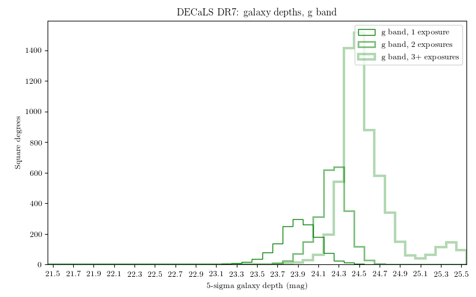
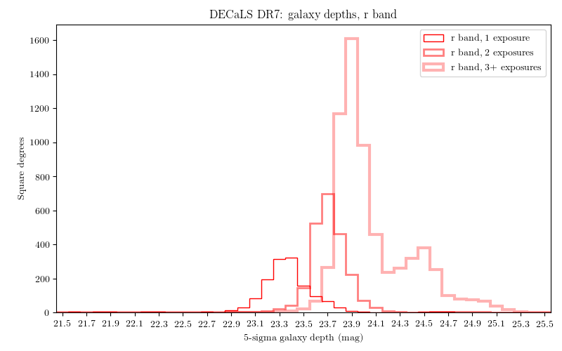
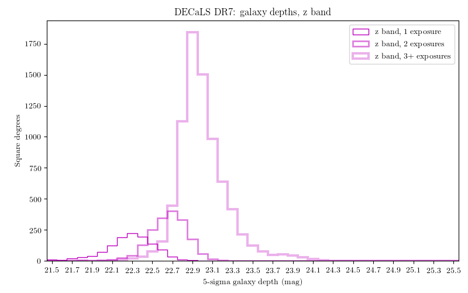

.. title: Data Release Description
.. slug: description
.. tags: mathjax
.. description:

.. |sigma|    unicode:: U+003C3 .. GREEK SMALL LETTER SIGMA
.. |sup2|     unicode:: U+000B2 .. SUPERSCRIPT TWO
.. |alpha|      unicode:: U+003B1 .. GREEK SMALL LETTER ALPHA
.. |chi|      unicode:: U+003C7 .. GREEK SMALL LETTER CHI
.. |delta|    unicode:: U+003B4 .. GREEK SMALL LETTER DELTA
.. |deg|    unicode:: U+000B0 .. DEGREE SIGN
.. |times|  unicode:: U+000D7 .. MULTIPLICATION SIGN
.. |plusmn| unicode:: U+000B1 .. PLUS-MINUS SIGN
.. |Prime|    unicode:: U+02033 .. DOUBLE PRIME
.. |geq|    unicode:: U+02265 .. GREATER THAN OR EQUAL TO

.. class:: pull-right well

.. contents::

The Legacy Surveys are producing an inference model of the 14,000 square degrees
of extragalactic sky visible from the northern hemisphere in three optical bands
(:math:`g,r,z`) and four infrared bands.  The sky coverage is approximately bounded by
-18\ |deg| < |delta| < +84\ |deg| in celestial coordinates and :math:`|b|` > 18\
|deg| in Galactic coordinates. To achieve this goal, the Legacy Surveys are conducting
3 imaging projects on different telescopes, described in more depth at the following links:

========================================== ===================================== ===========================================
*The Beijing-Arizona Sky Survey* (`BASS`_) *The DECam Legacy Survey* (`DECaLS`_) *The Mayall z-band Legacy Survey* (`MzLS`_)
========================================== ===================================== ===========================================

An overview of the surveys is available in `Dey et al. (2018)`_.

.. _`Dey et al. (2018)`: http://adsabs.harvard.edu/abs/2018arXiv180408657D
.. _`BASS`: ../../bass
.. _`DECaLS`: ../../decamls
.. _`MzLS`: ../../mzls
.. _`Tractor`: https://github.com/dstndstn/tractor
.. _`NOAO Community Pipeline`: http://www.noao.edu/noao/staff/fvaldes/CPDocPrelim/PL201_3.html
.. _`Ceres solver`: http://ceres-solver.org
.. _`SciPy`: http://www.scipy.org
.. _`mixture-of-gaussian`: http://arxiv.org/abs/1210.6563
.. _`SFD98`: http://adsabs.harvard.edu/abs/1998ApJ...500..525S
.. _`recommended conversions by the WISE team`: http://wise2.ipac.caltech.edu/docs/release/allsky/expsup/sec4_4h.html#conv2ab
.. _`Gaia Data Release 1`: http://gaia.esac.esa.int/documentation/GDR1/index.html
.. _`Gaia Data Release 2`: http://gaia.esac.esa.int/documentation/GDR2/index.html
.. _`DR6`: ../../dr6
.. _`DR5`: ../../dr5
.. _`DR4`: ../../dr4
.. _`DR3`: ../../dr3
.. _`DR2`: ../../dr2
.. _`DESI`: http://desi.lbl.gov
.. _`WISE`: http://wise.ssl.berkeley.edu

Contents of DR7
===============

Data Release 7 (DR7) is the seventh public data release of the Legacy Surveys. It is the
fifth public data release of images and catalogs from the DECam Legacy Survey (`DECaLS`_;
`DR6`_ comprised the second release of data from `BASS`_ and `MzLS`_).
Imaging from the Legacy Surveys is first reduced through the `NOAO Community Pipeline`_ before being 
processed using the `Tractor`_. DR7 also includes `WISE`_ fluxes force-photometered at
the locations of Legacy Surveys optical sources The WISE data included in each Data Release of 
the Legacy Surveys is included in `this table`_.

.. _`this table`: ../../files/unwise_w1_w2_dr_table.pdf

Images from `DECaLS`_
:math:`g,r,z`-band observations (NOAO survey program 0404; https://www.noao.edu/perl/abstract?2014B-0404)
are included from 12th August 2013 through 18th March 2018. DR7 also includes DECam data from a range of
non-DECaLS surveys, including observations that were conducted from August 2013 to March 2018.

The table below indicates the area covered in DR7 for different
numbers of passes and in different filters.
These are precise area estimates derived from the geometry of
CCDs that contribute to the Legacy Surveys footprint.

===================== ========== ========= =========
Band/Number of Passes |geq| 1    |geq| 2   |geq| 3
===================== ========== ========= =========
:math:`g`-band        9766 |d2|  8049 |d2| 5430 |d2|
:math:`r`-band        9853 |d2|  8152 |d2| 5588 |d2|
:math:`z`-band        10610 |d2| 9135 |d2| 6615 |d2|
All bands jointly     9298 |d2|  7180 |d2| 4355 |d2|
===================== ========== ========= =========

.. |d2| replace:: deg\ :sup:`2`

DR7 includes the stacked images and the Tractor-based catalogs.
The size of the DR7 data distribution is:

========== ============ =======================
Size*      Directory    Description
========== ============ =======================
326 GB     `calib/`_    Calibration files
21 TB      `coadd/`_    Co-added images, including |chi|\ |sup2|, depth, image, model, nexp, and Quality Assurance PNG plots
11 GB      `external/`_ Matches to other catalogs (SDSS, etc.)
59 MB      `gallery/`_  Images of notable galaxies (NGC, etc.)
55 GB      `logs/`_     Log files generated by Tractor processing
468 GB     `metrics/`_  Metrics
476 GB     `sweep/`_    Repackaged versions of the Tractor catalogs
1.5 TB     `tractor/`_  Tractor catalogs
========== ============ =======================

\*Note that although the *contents* of a directory should be fixed for each Data Release, the *size* of a directory can change. This is typically due to updated file compression. So, the listed directory sizes should be viewed as (very reasonable) estimates.

.. _`calib/`: http://portal.nersc.gov/project/cosmo/data/legacysurvey/dr7/calib/
.. _`coadd/`: http://portal.nersc.gov/project/cosmo/data/legacysurvey/dr7/coadd/
.. _`external/`: http://portal.nersc.gov/project/cosmo/data/legacysurvey/dr7/external/
.. _`gallery/`: http://portal.nersc.gov/project/cosmo/data/legacysurvey/dr7/gallery/
.. _`logs/`: http://portal.nersc.gov/project/cosmo/data/legacysurvey/dr7/logs/
.. _`metrics/`: http://portal.nersc.gov/project/cosmo/data/legacysurvey/dr7/metrics/
.. _`sweep/`: http://portal.nersc.gov/project/cosmo/data/legacysurvey/dr7/sweep/
.. _`tractor/`: http://portal.nersc.gov/project/cosmo/data/legacysurvey/dr7/tractor/

For all of the Legacy Surveys, including `DECaLS`_, co-added images and
`Tractor`_ catalogs are presented in "bricks" of approximate
size 0.25\ |deg| |times| 0.25\ |deg|.  Each brick is defined in terms of a box in RA,Dec
coordinates.  For the image stacks, we use a simple tangent-plane (WCS TAN)
projection around the brick center. The projections for the :math:`g,r,z` filters are identical.
There are 662,174 bricks spread over the sky, meaning that each brick has an average
area of 0.0623 deg\ :sup:`2`\ . The brick images have some overlap.
The co-added images should be
used with caution, as noted below in the *Image Stacks* section.

There are approximately 835 million unique sources in DR7 spread over 180,102 bricks.

Obtaining Images and Raw Data
==============================

Images, for all 3 of the Legacy Surveys can be viewed
directly using `the Sky viewer`_
and raw data can be obtained through `the NOAO portal`_ (or via ftp; see also the information near
the bottom of the `files`_ page).

Sections of `DECaLS`_ for DR7 can be obtained as JPEGs or FITS files using
the cutout service, as follows:

JPEG: http://legacysurvey.org/viewer/jpeg-cutout?ra=190.1086&dec=1.2005&layer=decals-dr7&pixscale=0.27&bands=grz

FITS: http://legacysurvey.org/viewer/fits-cutout?ra=190.1086&dec=1.2005&layer=decals-dr7&pixscale=0.27&bands=grz

where "bands" is a string such as ":math:`grz`",":math:`gz`",":math:`g`", etc. The
size of the image can also be specified using :math:`width`, :math:`height` and :math:`size`,
where :math:`size` forces :math:`width` and :math:`height` to be equal. For example:

http://legacysurvey.org/viewer/jpeg-cutout?ra=190.1086&dec=1.2005&width=100&layer=decals-dr7&pixscale=0.3&bands=grz

http://legacysurvey.org/viewer/jpeg-cutout?ra=190.1086&dec=1.2005&height=100&layer=decals-dr7&pixscale=0.3&bands=grz

http://legacysurvey.org/viewer/jpeg-cutout?ra=190.1086&dec=1.2005&size=100&layer=decals-dr7&pixscale=0.3&bands=grz

It is possible to retrieve multiple cutouts from the command line using standard utilites such as `wget`_.

The maximum size for cutouts (in number of pixels) is currently 512.
Pixscale=0.262 will return (approximately) the native pixels used by the `Tractor`_.
For information on how to recover `BASS`_ and `MzLS`_ cutouts, see the `DR6 description`_ page.

.. _`wget`: https://www.gnu.org/software/wget/manual/wget.html#Overview
.. _`DR6 description`: ../../dr6/description
.. _`files`: ../files
.. _`the Sky viewer`: http://legacysurvey.org/viewer
.. _`the NOAO portal`: http://archive.noao.edu/search/query

Source Detection
================

The source detection uses a PSF- and SED-matched-filter detection on
the stacked images, with a 6\ |sigma| detection limit.
The `Tractor`_ fitting step is initialized with these positions, although
these positions can be changed during the fits and
low-S/N sources can be removed.

For source detection, each image is convolved by its PSF model,
then a weighted stack
of these is created in order to optimize the point-source detection
efficiency.  Next, SED-matched combinations of the three bands are
created, for two SEDs: "flat" (a source with AB color zero), and
"red", a source with AB color :math:`g-r = 1`, :math:`r-z = 1`.  Sources above 6\ |sigma|
are detected in each of these two SED-matched filters, as well as in each band independently.

The locations of the peak fluxes of extracted sources are used to determine where objects 
are photometered and how the initial parameters for an object are seeded. When a source is detected 
in multiple bands a choice of filter must be made to seed the initial extraction. 
Sources detected in other bands beyond the initial filter are only kept if they are 
sufficiently separated from an object that was extracted in previous bands.
In `DR4`_, `DR3`_ and earlier data releases,
source detection was run first in :math:`g`, then in :math:`r`, :math:`z`, "flat"
and finally in "red".
In `DR5`_, `DR6`_ and DR7, source detection 
was run first in :math:`z`, then in :math:`r`, :math:`g`, "flat"
and finally in "red". :math:`z` was chosen as the "primary" detection image
to take advantage of the better PSF in that band.

Starting with DR7 we relaxed some of the criteria for deciding whether a
flux peak is a distinct source. We reduced the minimum possible distance between
neighboring peaks from 6 pixels (about 1.5 arcseconds) to 4 pixels (about 1 arcsecond). 
We also reduced the "saddle" depth (dip in flux) necessary
to model neighboring peaks as distinct sources.

Starting with DR7, Gaia stars are extracted as independent sources. Stars from `Tycho-2`_
and `Gaia Data Release 2`_ are matched, and their Gaia information is retained.
Such stars are then fixed at their Gaia positions shifted by their
proper motions in order to determine their positions at the epoch of their 
Legacy Surveys image. Gaia stars are forced to remain stars (galaxy models are
never considered as an option for such sources) but their fluxes are extracted from the
Legacy Surveys images. `Tycho-2`_ stars have ``brightstarinblob`` set (see the `catalogs`_
page) and all other sources that share a blob with the star are fit as point sources.
The reasoning behind this choice is that `Tycho-2`_ stars, at 12th magnitude and
brighter, have large halos that are not include in our model choices and are best fit
by misleading (and computationally expensive) diffuse galaxy models.

.. _`catalogs`: ../catalogs
.. _`Tycho-2`: https://heasarc.nasa.gov/W3Browse/all/tycho2.html

PSF
===

The Tractor makes use of the PSF on each individual exposure. The PSF for
the individual exposures are first computed independently for each CCD
using `PSFEx`_, generating spatially-varying pixelized models.

The configuration files for SExtractor and PSFex that we used for a given
iteration of our codebase are available `on our github page`_.

.. _`PSFEx`: http://www.astromatic.net/software/psfex
.. _`on our github page`: https://github.com/legacysurvey/legacypipe-dir/tree/master/calib/se-config

Sky Level
=========

The Community Pipeline removes a sky level that includes a sky pattern, an illumination correction,
and a single scaled fringe pattern. These steps are described on the `NOAO Community Pipeline`_
page.
This makes the sky level in the processed images near zero, and removes most pattern artifacts.
A constant sky level is then added back to the image that is the mean of what was removed.

Additionally, we compute and remove a spatially varying (spline) sky
model, by detecting and masking sources, then computing medians in
sliding 512-pixel boxes. The stacked images have this sky level
removed.

Tractor Catalogs
================

The Tractor code runs within the geometrical region
of a brick. This fitting is performed on the individual exposures
that overlap the brick, without making use of the image stacks.
This preserves the full information content of the data set in the fits,
handles masked pixels without the need for uncertain interpolation techniques,
and fits to data points without the complication of pixel covariances.

Morphological Classification
============================

The `Tractor`_ fitting can allow any of the source properties or
image calibration parameters (such as the PSF) to float.
Only the source properties were allowed to float in DR7.
These are continuous properties for the object centers, fluxes,
and the shape parameters. 

There is also the discrete choice of which
model type to use. In DR7, five morphological types are used: point sources,
round exponential galaxies with a variable radius ("REX"), deVaucouleurs profiles
(elliptical galaxies), exponential profiles (spiral galaxies), and composite
profiles that are deVaucouleurs + exponential (with the same source center).
The total numbers of the different morphological types in DR7 are:

================= ==================
Number of Sources Type
================= ==================
   834,782,188    Objects in a Primary brick
   400,038,485    ``PSF``
   329,081,955    ``REX``
    73,989,292    ``EXP``
    29,713,159    ``DEV``
     1,959,297    ``COMP``
================= ==================

Note that the "REX" model replaces the "SIMP" model used in
`DR4`_, `DR3`_ and earlier data releases.

The decision to retain an object in the catalog and to re-classify it using
models more complicated than a point source is made using the penalized
changes to |chi|\ |sup2| in the image after subtracting the models for other sources.
The "PSF" and "REX" models are computed for every source and the better of these 
two is used when deciding whether to keep the source. A source is retained if its 
penalized |chi|\ |sup2| is improved by 25; this corresponds to a |chi|\ |sup2| 
difference of 27 (because of the penalty of 2 for the source centroid).  Sources 
below this threshold are removed.

The source is classified as the better of "point source (PSF)" or "round exponential 
galaxy (REX)" unless the penalized |chi|\ |sup2| is improved by 9 (*i.e.*, 
approximately a 3\ |sigma| improvement) by treating it as a deVaucouleurs or 
exponential profile. The classification is a composite of deVaucouleurs + exponential 
if it is both a better fit to a single profile over the point source, and the composite 
improves the penalized |chi|\ |sup2| by another 9.  These choices implicitly mean
that any extended source classifications have to be at least 5.8\ |sigma| detections
and that composite profiles must be at least 6.5\ |sigma| detections.

The fluxes are not constrained to be positive-valued.  This allows the fitting of 
very low signal-to-noise sources without introducing biases at the faint end.  It 
also allows the stacking of fluxes at the catalog level.

Tractor Implementation Details
==============================

Tractor fundamentally treats the fitting as a |chi|\ |sup2| minimization
problem.  The current core routine uses the sparse least squares
solver from the `SciPy`_ package, or the open source
`Ceres solver`_, originally developed by Google.

The galaxy profiles (the exponential and deVaucouleurs profiles mentioned above
under *Morphological Classification*) are approximated with `mixture-of-gaussian`_ 
(MoG) models and are convolved by the pixelized PSF models using a new 
Fourier-space method (Lang, in prep).
The galaxy profile approximation introduces errors in these
models typically at the level of :math:`10^{-4}` or smaller.
The PSF models are treated as pixel-convolved quantities,
and are evaluated at the integral pixel coordinates without integrating
any functions over the pixels.

The Tractor algorithm could be run with both the source parameters
and the calibration parameters allowed to float, at the cost of
more compute time and the necessity to use much larger blobs because
of the non-locality of the calibrations.  A more practical approach
would be to iterate between fitting source parameters in brick space,
and fitting calibration parameters in exposure space.  Such iterations
will be considered and tested for future data releases.
Another practical issue is that the current PSF models may allow
too much freedom.

Photometry
==========

The flux calibration for `DECaLS`_ is on the AB natural system of the DECam instrument.
An AB system reports the same flux in any band for a source whose spectrum is
constant in units of erg/cm\ |sup2|/Hz. A source with a spectrum of
:math:`f = 10^{-(48.6+22.5)/2.5}` erg/cm\ |sup2|/Hz
would be reported to have an integrated flux of 1 nanomaggie in any filter.
The natural system means that we have not
applied color terms to any of the photometry, but report fluxes as observed in the DECam filters.

Zero point magnitudes for the CP reductions of the DECam images
were computed by comparing Legacy Survey PSF photometry to 
`Pan-STARRS-1 (PS1) PSF photometry`_, where the latter was modified with color terms
to place the PS1 photometry on the DECam system.  The same color terms
are applied to all CCDs.
Zero points are computed separately for each CCD, but not for each amplifier.
The color terms to convert from PS1 to DECam were computed for stars
in the color range :math:`0.4 < (g-i) < 2.7` as follows:

.. math::
                (g-i) & = & g_{\mathrm{PS}} - i_{\mathrm{PS}} \\
   g_{\mathrm{DECam}} & = & g_{\mathrm{PS}} + 0.00062 + 0.03604 (g-i) + 0.01028 (g-i)^2 - 0.00613 (g-i)^3 \\
   r_{\mathrm{DECam}} & = & r_{\mathrm{PS}} + 0.00495 - 0.08435 (g-i) + 0.03222 (g-i)^2 - 0.01140 (g-i)^3 \\
   z_{\mathrm{DECam}} & = & z_{\mathrm{PS}} + 0.02583 - 0.07690 (g-i) + 0.02824 (g-i)^2 - 0.00898 (g-i)^3 \\

Note that these zero points have been `updated since DR5`_.

.. _`updated since DR5`: ../../dr5/description
.. _`Pan-STARRS-1 (PS1) PSF photometry`: http://adsabs.harvard.edu/abs/2016ApJ...822...66F

The brightnesses of objects are all stored as linear fluxes in units of nanomaggies.  The conversion
from linear fluxes to magnitudes is :math:`m = 22.5 - 2.5 \log_{10}(\mathrm{flux})`. 
These linear fluxes are well-defined even at the faint end, and the errors on the linear 
fluxes should be very close to a normal distribution.  The fluxes can be negative for faint 
objects, and indeed we expect many such cases for the faintest objects.

The filter curves are available for `DECaLS g-band`_, `DECaLS r-band`_ and `DECaLS z-band`_.

Starting with `DR6`_, PSF photometry uses the same PSF models
(and sky background subtraction) for zeropoint-fitting as is later used in cataloging.
This was not the case for `DR5`_ or before.
So, for DR7, the measured fluxes for PS1 stars should be completely self-consistent.

The WISE Level 1 images and the `unWISE`_ image stacks are on a Vega system.
We have converted these to an AB system using the `recommended conversions by the WISE team`_. Namely,
:math:`\mathrm{Flux}_{\mathrm{AB}} = \mathrm{Flux}_{\mathrm{Vega}} * 10^{-(\Delta m/2.5)}`
where :math:`\Delta m` = 2.699, 3.339, 5.174, and 6.620 mag in the W1, W2, W3 and W4 bands.
For example, a WISE W1 image should be multiplied by :math:`10^{-2.699/2.5} = 0.083253` to
give units consistent with the Tractor catalogs. These conversion factors are recorded in the
Tractor catalog headers ("WISEAB1", etc). The result is that the optical and WISE fluxes 
we provide should all be within a few percent of being on an AB system.

.. _`unWISE`: https://arxiv.org/abs/1801.03566 
.. _`BASS website`: http://batc.bao.ac.cn/BASS/doku.php?id=datarelease:telescope_and_instrument:home#filters
.. _`BASS g-band`: ../../files/bass-g.txt
.. _`BASS r-band`: ../../files/bass-r.txt
.. _`MzLS z-band`: ../../files/kpzd.txt
.. _`MzLS z-band with corrections`: ../../files/kpzdccdcorr3.txt
.. _`DECaLS g-band`: ../../files/decam.g.am1p4.dat.txt
.. _`DECaLS r-band`: ../../files/decam.r.am1p4.dat.txt
.. _`DECaLS z-band`: ../../files/decam.z.am1p4.dat.txt
.. _`Mosaic-3`: http://www-kpno.kpno.noao.edu/mosaic/index.html
.. _`90Prime`: https://soweb.as.arizona.edu/~tscopewiki/doku.php?id=90prime_info

Galactic Extinction
===================

Eddie Schlafly has computed the extinction coefficients for the DECam filters through airmass=1.3.
Those coefficients are 3.995, 3.214, 2.165, 1.592, 1.211, 1.064 for :math:`ugrizY`,
computed for a 7000K source spectrum as was done in the Appendix of `Schlafly et al (2011)`_.
These coefficients are multiplied 
by the `SFD98`_ E(B-V) values at the coordinate of each object to derive the ``MW_TRANSMISSION``
values in the Legacy Surveys `catalogs`_.
The coefficients at different airmasses
only change by a small amount, with the largest effect in :math:`g`-band where the coefficient would
be 3.219 at airmass=1 and 3.202 at airmass=2.

.. _`Schlafly et al (2011)`: http://adsabs.harvard.edu/abs/2011ApJ...737..103S 

A similar process was conducted to derive ``MW_TRANSMISSION`` in the WISE bands.

Astrometry
==========

DR7 astrometry is tied to Gaia, but in a (very slightly) inconsistent fashion. Each image is calibrated to
`Gaia Data Release 1`_, yielding an astrometric solution that is offset by the average difference between
the position of Gaia stars at an epoch of 2015.0 and the epoch of the DR6 image. Source
extraction is then fixed to the `Gaia Data Release 2`_ system, such that positions of sources are tied to 
predicted Gaia positions at the epoch of the corresponding Legacy Survey observation. Despite
these inconsistencies, astrometric residuals are typically smaller than |plusmn|\ 0.03\ |Prime|.

Astrometric calibration of all optical Legacy Survey data is conducted using Gaia
astrometric positions of stars matched to Pan-STARRS-1 (PS1).
The same matched objects are used for both astrometric and photometric calibration. 

Starting with `DR6`_, PSF photometry uses the same PSF models
(and sky background subtraction) for zero-point-fitting as is later used in cataloging.
This was not the case for `DR5`_ or before.

Image Stacks
============

The image stacks are provided for convenience, but were not used in the Tractor fits.
These images overlap adjacent images by approximately 130 pixels in each direction.
These are tangent projections centered at each brick center, North up, with dimensions of 3600 |times| 3600
and a scale of 0.262\ |Prime|/pix.  The image stacks are computed using Lanczos-3
interpolation. These stacks have not been designed for "precision" work.

Depths
======

The histograms below depict the median 5\ |sigma| point source (AB) depths for areas with
different numbers of observations in DR7.

These are based upon the formal errors in the Tractor catalogs for point sources; those
errors need further confirmation. These can be compared to the predicted proposed
depths for 2 observations at 1.5\ |Prime| seeing of :math:`g=24.7`, :math:`r=23.9`, :math:`z=23.0`.

Code Versions
=============

* `LegacyPipe <https://github.com/legacysurvey/legacypipe>`_: Most bricks were run with dr7v3.31. A few were finished with dr7v3.32. The version used is documented in the Tractor header card ``LEGPIPEV``.
* `Astrometry.net <https://github.com/dstndstn/astrometry.net>`_: 0.74.
* `Tractor <https://github.com/dstndstn/tractor>`_: dr7.0.
* `NOAO Community Pipeline <http://www.noao.edu/noao/staff/fvaldes/CPDocPrelim/PL201_3.html>`_: mixture of versions; recorded as ``PLVER``.
* `SourceExtractor <http://www.astromatic.net/software/sextractor>`_: 2.19.5.
* `PSFEx <http://www.astromatic.net/software/psfex>`_: 3.17.1.

.. _`Legacy Survey Data Release 2`: ../../dr2
.. _`Legacy Survey Data Release 3`: ../../dr3
.. _`Legacy Survey Data Release 4`: ../../dr4
.. _`Legacy Survey Data Release 5`: ../../dr5
.. _`Legacy Survey Data Release 6`: ../../dr6

Glossary
========

BASS
    `Beijing-Arizona Sky Survey <http://legacysurvey.org/bass>`_.

Blob
    Continguous region of pixels above a detection threshold and neighboring
    pixels; Tractor is optimized within blobs.

Brick
    A region bounded by lines of constant RA and DEC; reductions
    are performed within bricks of size approximately 0.25\ |deg| |times| 0.25\ |deg|.

CP
    Community Pipeline (reduction pipeline operated by NOAO;
    http://www.noao.edu/noao/staff/fvaldes/CPDocPrelim/PL201_3.html).

DECaLS
    `Dark Energy Camera Legacy Survey <http://legacysurvey.org/decamls>`_.

DR2
    `Legacy Survey Data Release 2`_.

DR3
    `Legacy Survey Data Release 3`_.

DR4
    `Legacy Survey Data Release 4`_.

DR5
    `Legacy Survey Data Release 5`_.

DR6
    `Legacy Survey Data Release 6`_.

DECam
    Dark Energy Camera on the NOAO Blanco 4-meter telescope.

maggie
    Linear flux units, where an object with an AB magnitude of 0 has a
    flux of 1.0 maggie.  A convenient unit is the nanomaggie: a flux of 1 nanomaggie
    corresponds to an AB magnitude of 22.5.

MoG
    Mixture-of-gaussian model to approximate the galaxy models (http://arxiv.org/abs/1210.6563).

MzLS
    `Mayall z-band Legacy Survey <http://legacysurvey.org/mzls>`_.

NOAO
    `National Optical Astronomy Observatory <http://www.noao.edu>`_.

nanomaggie
    Linear flux units, where an object with an AB magnitude of 22.5 has a flux
    of :math:`1 \times 10^{-9}` maggie or 1.0 nanomaggie.

PSF
    Point spread function.

PSFEx
    `Emmanuel Bertin's PSF fitting code <http://www.astromatic.net/software/psfex>`_.

SDSS
    `Sloan Digital Sky Survey <http://www.sdss.org>`_.

SDSS DR12
    `Sloan Digital Sky Survey Data Release 12 <https://www.sdss.org/dr12/>`_.

SDSS DR13
    `Sloan Digital Sky Survey Data Release 13 <https://www.sdss.org/dr13/>`_.

SED
    Spectral energy distribution.

SourceExtractor
    `Source Extractor reduction code <http://www.astromatic.net/software/sextractor>`_.

SFD98
    Schlegel, Finkbeiner & Davis 1998 extinction maps (http://adsabs.harvard.edu/abs/1998ApJ...500..525S).

Tractor
    `Dustin Lang's inference code <https://github.com/dstndstn/tractor>`_.

unWISE
    New coadds of the WISE imaging, at original full resolution
    (http://unwise.me, http://arxiv.org/abs/1405.0308).

WISE
    `Wide Infrared Survey Explorer <http://wise.ssl.berkeley.edu>`_.
