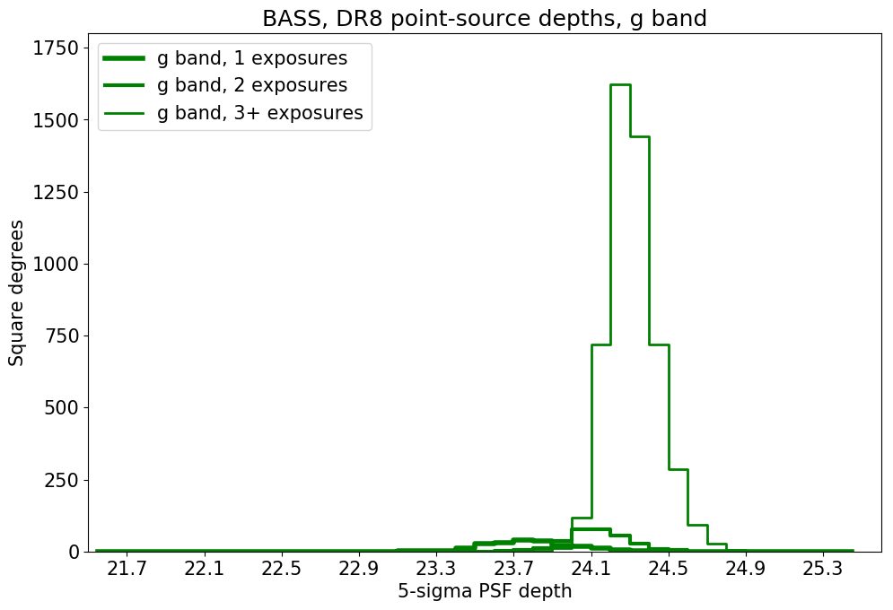
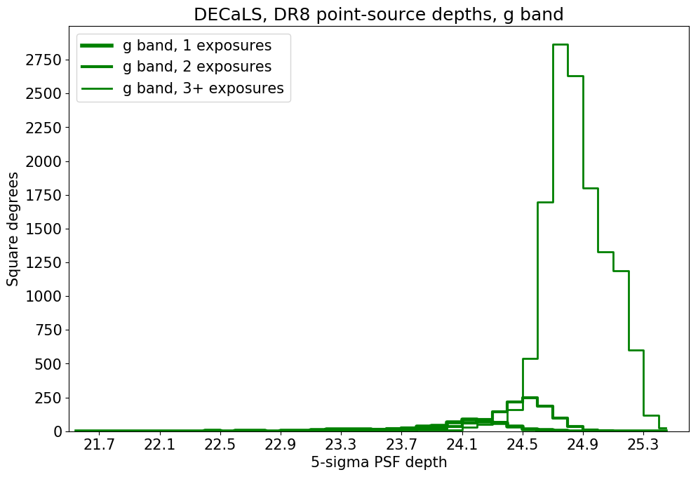
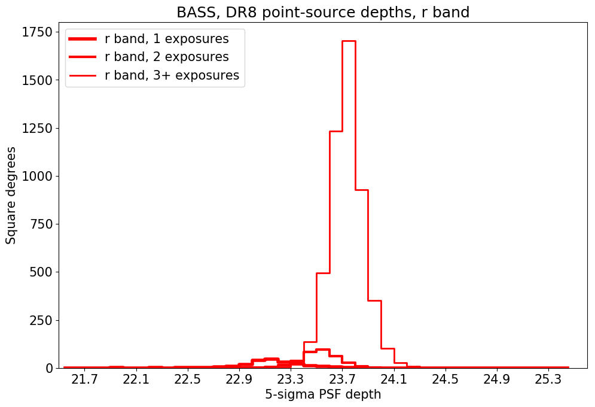
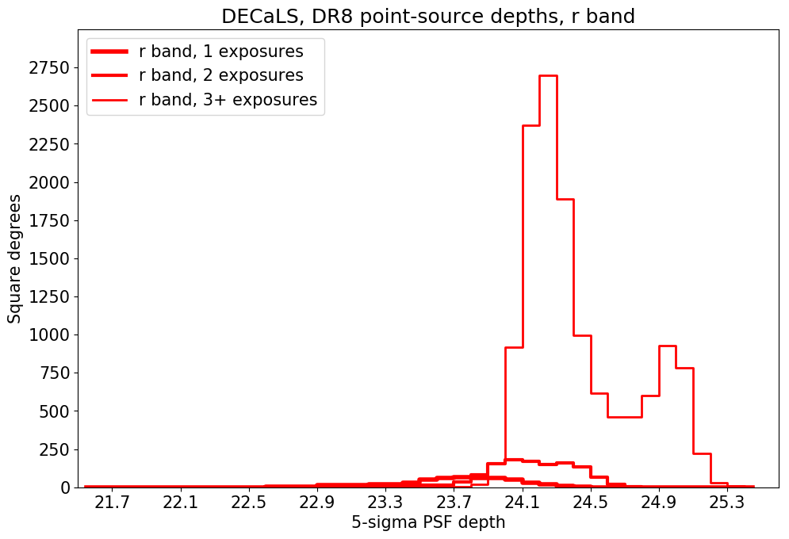
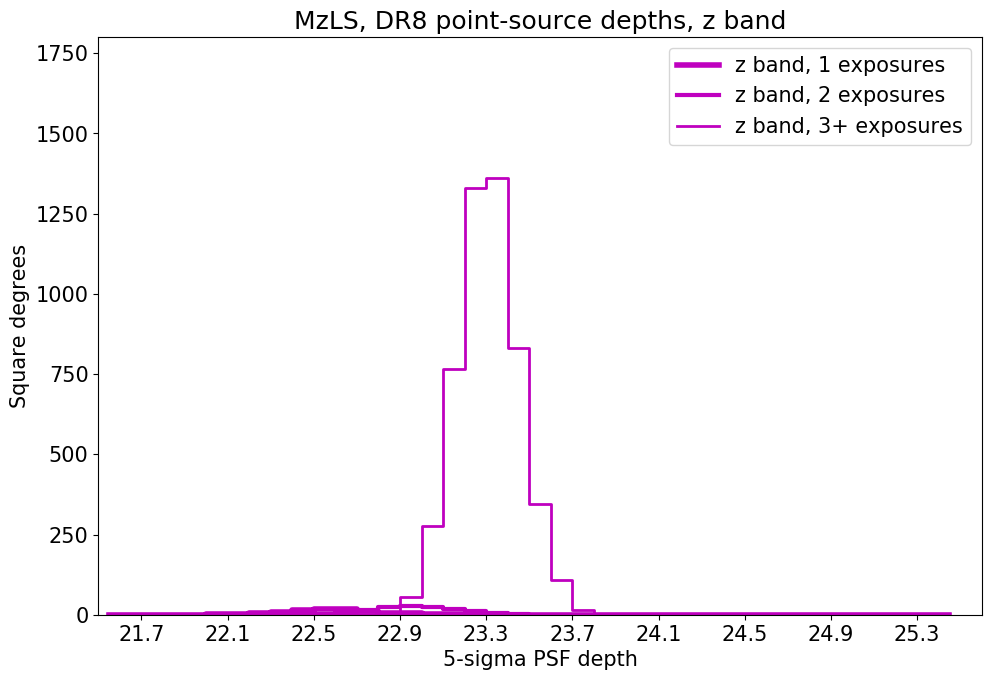
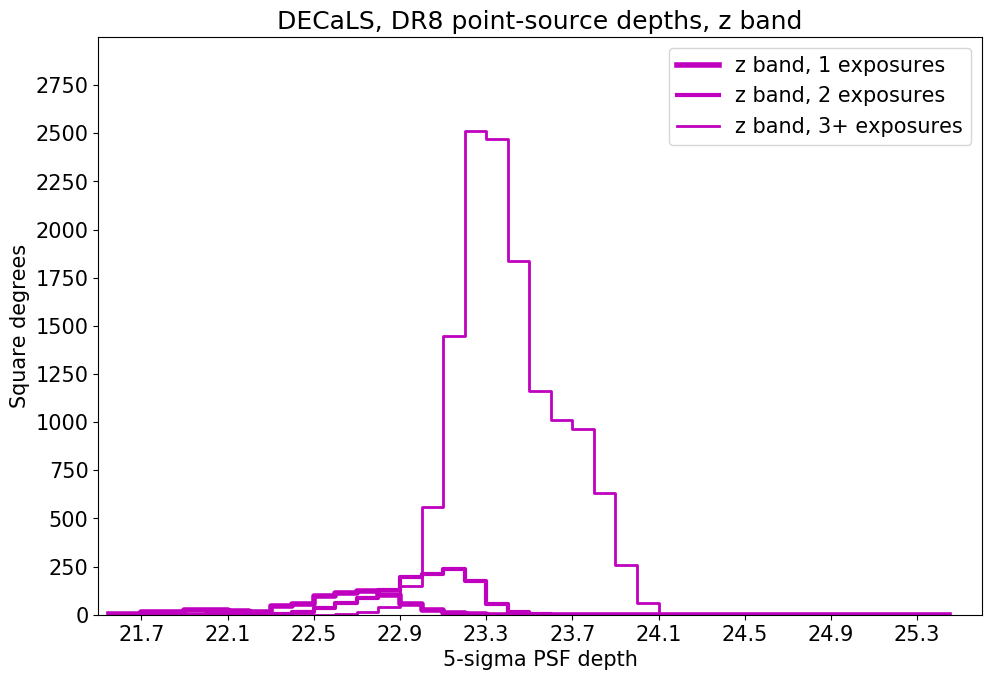

.. title: Data Release Description
.. slug: description
.. tags: mathjax
.. description:

.. |sigma|    unicode:: U+003C3 .. GREEK SMALL LETTER SIGMA
.. |sup2|     unicode:: U+000B2 .. SUPERSCRIPT TWO
.. |alpha|      unicode:: U+003B1 .. GREEK SMALL LETTER ALPHA
.. |chi|      unicode:: U+003C7 .. GREEK SMALL LETTER CHI
.. |delta|    unicode:: U+003B4 .. GREEK SMALL LETTER DELTA
.. |deg|    unicode:: U+000B0 .. DEGREE SIGN
.. |times|  unicode:: U+000D7 .. MULTIPLICATION SIGN
.. |plusmn| unicode:: U+000B1 .. PLUS-MINUS SIGN
.. |Prime|    unicode:: U+02033 .. DOUBLE PRIME
.. |geq|    unicode:: U+02265 .. GREATER THAN OR EQUAL TO

.. class:: pull-right well

.. contents::

The DESI Legacy Imaging Surveys are producing an inference model of the 14,000 square degrees
of extragalactic sky visible from the northern hemisphere in three optical bands
(:math:`g,r,z`) and four infrared bands.  The sky coverage is approximately bounded by
-18\ |deg| < |delta| < +84\ |deg| in celestial coordinates and :math:`|b|` > 18\
|deg| in Galactic coordinates. To achieve this goal, the Legacy Surveys are conducting
3 imaging projects on different telescopes, described in more depth at the following links:

========================================== ===================================== ===========================================
*The Beijing-Arizona Sky Survey* (`BASS`_) *The DECam Legacy Survey* (`DECaLS`_) *The Mayall z-band Legacy Survey* (`MzLS`_)
========================================== ===================================== ===========================================

An overview of the surveys is available in `Dey et al. (2019)`_.

.. _`Dey et al. (2019)`: https://ui.adsabs.harvard.edu/abs/2019AJ....157..168D/abstract
.. _`BASS`: ../../bass
.. _`DECaLS`: ../../decamls
.. _`MzLS`: ../../mzls
.. _`Tractor`: https://github.com/dstndstn/tractor
.. _`NSF's OIR Lab Community Pipeline`: http://www.noao.edu/noao/staff/fvaldes/CPDocPrelim/PL201_3.html
.. _`Ceres solver`: http://ceres-solver.org
.. _`SciPy`: http://www.scipy.org
.. _`mixture-of-Gaussians`: http://arxiv.org/abs/1210.6563
.. _`Mixture-of-Gaussians`: http://arxiv.org/abs/1210.6563
.. _`SFD98`: http://ui.adsabs.harvard.edu/abs/1998ApJ...500..525S
.. _`recommended conversions by the WISE team`: http://wise2.ipac.caltech.edu/docs/release/allsky/expsup/sec4_4h.html#conv2ab
.. _`Gaia Data Release 2`: http://gaia.esac.esa.int/documentation/GDR2/index.html
.. _`DR7`: ../../dr7
.. _`DR6`: ../../dr6
.. _`DR5`: ../../dr5
.. _`DR4`: ../../dr4
.. _`DR3`: ../../dr3
.. _`DR2`: ../../dr2
.. _`DESI`: http://desi.lbl.gov
.. _`WISE`: http://wise.ssl.berkeley.edu
.. _`year 4 of NEOWISE-Reactivation`: http://wise2.ipac.caltech.edu/docs/release/neowise/neowise_2018_release_intro.html
.. _`NSF's OIR Lab survey program 0404`: https://www.noao.edu/perl/abstract?2014B-0404
.. _`Dark Energy Survey`: https://www.darkenergysurvey.org

Contents of DR8
===============

Data Release 8 (DR8) is the eighth public data release of the Legacy Surveys. It is the
sixth public data release of images and catalogs from `DECaLS`_ (`DR7`_ comprised the fifth release of data from `DECaLS`_)
and the third release of data from `BASS`_ and `MzLS`_ (`DR6`_ comprised the second release of data from `BASS`_ and `MzLS`_).
DR8 is the first release to include images and catalogs from all three of the Legacy Surveys in a single release.
Imaging from the Legacy Surveys is first reduced through the `NSF's OIR Lab Community Pipeline`_ before being
processed using the `Tractor`_. DR8 also includes `WISE`_ fluxes from all imaging through `year 4 of
NEOWISE-Reactivation`_ force-photometered in the `unWISE`_ maps at the locations of Legacy Surveys optical sources.

DR8 includes `BASS`_ (:math:`g,r`-band) images taken from 12th November 2015 through 7th March 2019 and
`MzLS`_ (:math:`z`-band) images taken from 19th November 2015 through 12th February 2018.
Images from `DECaLS`_
:math:`g,r,z`-band observations (`NSF's OIR Lab survey program 0404`_)
are included from 9th August 2014 through 7th March 2019. DR8 also includes DECam data from a range of
non-DECaLS surveys, including observations that were conducted from 1st September 2013 to 7th March 2019.
A large portion of these non-DECaLS observations were taken by the `Dark Energy Survey`_.
This information was derived from the Legacy Surveys `survey-ccds-* files`_.

The table below indicates the area covered in DR8 for different
numbers of passes and in different filters across the entire *unique* survey area. Unique area is resolved by including all
DECam images (the majority of which are from `DECaLS`_) but only including `BASS`_ and `MzLS`_ images if they are both at Declination > 32.375\ |deg| and north of the Galactic Plane.
These are area estimates derived from the geometry of the CCDs that contribute to the Legacy Surveys footprint.

===================== =========== =========== ===========
Band/Number of Passes |geq| 1     |geq| 2     |geq| 3
===================== =========== =========== ===========
:math:`g`-band        19,692 |d2| 18,767 |d2| 15,430 |d2|
:math:`r`-band        19,698 |d2| 18,759 |d2| 15,321 |d2|
:math:`z`-band        19,852 |d2| 18,759 |d2| 15,595 |d2|
All bands jointly     19,437 |d2| 18,036 |d2| 13,161 |d2|
===================== =========== =========== ===========

.. |d2| replace:: deg\ :sup:`2`

DR8 includes a variety of pixel-level and catalog-level products, which are described in more
detail on the `files`_ page.
The size of the DR8 data distribution, split out into contributions from
the north (`BASS`_/`MzLS`_) and south (`DECaLS`_) to match the directory structure of DR8 is:

================== ========================================= =========================================================
Size*              Directory                                 Description
================== ========================================= =========================================================
1.1 TB             `calib/`_                                 Calibration files
12 TB + 33 TB      `north/coadd/`_ + `south/coadd/`_         Coadded images (image stacks)
8.4 GB + 8.4 GB    `north/external/`_ + `south/external/`_   `Matches to other catalogs`_ (SDSS, etc.)
3.8 TB             `forced/`_                                Forced photometry catalogs.
30 MB              `gallery/`_                               Notable images (*e.g.* NGC galaxies)
9.6 GB + 13 GB     `north/logs/`_ + `south/logs/`_           Log files generated by `Tractor`_ processing
288 GB + 1.1 TB    `north/metrics/`_ + `south/metrics/`_     Metrics and statisics of Tractor fits
363 GB	           `randoms/`_                               Catalogs of random points
167 GB + 624 GB    `north/sweep/`_ + `south/sweep/`_         Subsets of the Tractor `catalogs`_; photometric redshifts
479 GB + 1.8 TB    `north/tractor/`_ + `south/tractor/`_     The Tractor `catalogs`_
================== ========================================= =========================================================

.. _`Matches to other catalogs`: ../files/#external-files-region-external

\*Note that although the *contents* of a directory should be fixed for each Data Release, the *size* of a directory can change. This is typically due to updated file compression. So, the listed directory sizes should be viewed as (very reasonable) estimates.

.. _`calib/`: http://portal.nersc.gov/cfs/cosmo/data/legacysurvey/dr8/calib/
.. _`north/coadd/`: http://portal.nersc.gov/cfs/cosmo/data/legacysurvey/dr8/north/coadd/
.. _`south/coadd/`: http://portal.nersc.gov/cfs/cosmo/data/legacysurvey/dr8/south/coadd/
.. _`north/external/`: http://portal.nersc.gov/cfs/cosmo/data/legacysurvey/dr8/north/external/
.. _`south/external/`: http://portal.nersc.gov/cfs/cosmo/data/legacysurvey/dr8/south/external/
.. _`forced/`: http://portal.nersc.gov/cfs/cosmo/data/legacysurvey/dr8/forced/
.. _`gallery/`: https://portal.nersc.gov/cfs/cosmo/data/legacysurvey/dr8/gallery/
.. _`images/`: http://portal.nersc.gov/cfs/cosmo/data/legacysurvey/dr8/images/
.. _`north/logs/`: http://portal.nersc.gov/cfs/cosmo/data/legacysurvey/dr8/north/logs/
.. _`south/logs/`: http://portal.nersc.gov/cfs/cosmo/data/legacysurvey/dr8/south/logs/
.. _`north/metrics/`: http://portal.nersc.gov/cfs/cosmo/data/legacysurvey/dr8/north/metrics/
.. _`south/metrics/`: http://portal.nersc.gov/cfs/cosmo/data/legacysurvey/dr8/south/metrics/
.. _`randoms/`: http://portal.nersc.gov/cfs/cosmo/data/legacysurvey/dr8/randoms/
.. _`north/sweep/`: http://portal.nersc.gov/cfs/cosmo/data/legacysurvey/dr8/north/sweep/
.. _`south/sweep/`: http://portal.nersc.gov/cfs/cosmo/data/legacysurvey/dr8/south/sweep/
.. _`north/tractor/`: http://portal.nersc.gov/cfs/cosmo/data/legacysurvey/dr8/north/tractor/
.. _`south/tractor/`: http://portal.nersc.gov/cfs/cosmo/data/legacysurvey/dr8/south/tractor/

For all of the DESI Legacy Imaging Surveys, coadded images and
Tractor catalogs are presented in "bricks" of approximate
size 0.25\ |deg| |times| 0.25\ |deg|.  Each brick is defined in terms of a box in RA,Dec
coordinates.  The image stacks use a simple tangent-plane (WCS TAN)
projection around the brick center. The projections for the :math:`g,r,z` filters are identical, with
a pixel scale of 0.262\ |Prime|/pix. The projections for the four WISE filters also identical
but with a pixel scale of 2.75\ |Prime|/pix.
There are 662,174 bricks spread over the sky, meaning that each brick has an average
area of 0.0623 deg\ :sup:`2`\ . The brick images have some overlap.

There are approximately 1.6 billion unique sources in DR8 spread over 326,154 unique bricks.

Obtaining Images and Raw Data
==============================

Images for all 3 of the Legacy Surveys can be viewed
directly using `the Sky viewer`_
and raw data can be obtained through `the Astro Data Lab's portal`_ (or via ftp; see also the information near
`the bottom of the files`_ page).

Sections of the Legacy Surveys  for DR8 can be obtained as JPEGs or FITS files using
the cutout service, for example, as follows:

JPEG: http://legacysurvey.org/viewer/jpeg-cutout?ra=190.1086&dec=1.2005&layer=dr8&pixscale=0.27&bands=grz

FITS: http://legacysurvey.org/viewer/fits-cutout?ra=190.1086&dec=1.2005&layer=dr8&pixscale=0.27&bands=grz

This will merge the northern (MzLS+BASS) and equatorial (DECam) images at the Dec=32.375 line.

To request images from only the northern or equatorial surveys, specify `dr8-north` or `dr8-south`, for example:

JPEG (`DECaLS`_): http://legacysurvey.org/viewer/jpeg-cutout?ra=190.1086&dec=1.2005&layer=dr8-south&pixscale=0.27&bands=grz

FITS (`DECaLS`_): http://legacysurvey.org/viewer/fits-cutout?ra=190.1086&dec=1.2005&layer=dr8-south&pixscale=0.27&bands=grz

JPEG (`BASS`_/`MzLS`_): http://legacysurvey.org/viewer/jpeg-cutout?ra=154.7709&dec=46.4537&layer=dr8-north&pixscale=0.27&bands=grz

FITS (`BASS`_/`MzLS`_): http://legacysurvey.org/viewer/fits-cutout?ra=154.7709&dec=46.4537&layer=dr8-north&pixscale=0.27&bands=grz

where "bands" is a string such as ":math:`grz`",":math:`gz`",":math:`g`", etc.

Replacing `layer=dr8` (or `layer=dr8-north`) with `layer=dr8-model` (`layer=dr8-north-model`)
or `layer=dr8-resid` (`layer=dr8-north-resid`) will instead return cutouts for the model and residual images, respectively.

The size of the image can also be specified using :math:`width`, :math:`height` and :math:`size`,
where :math:`size` forces :math:`width` and :math:`height` to be equal. For example:

http://legacysurvey.org/viewer/jpeg-cutout?ra=190.1086&dec=1.2005&width=100&layer=dr8&pixscale=0.3&bands=grz

http://legacysurvey.org/viewer/jpeg-cutout?ra=190.1086&dec=1.2005&height=100&layer=dr8&pixscale=0.3&bands=grz

http://legacysurvey.org/viewer/jpeg-cutout?ra=190.1086&dec=1.2005&size=100&layer=dr8&pixscale=0.3&bands=grz

It is possible to retrieve multiple cutouts from the command line using standard utilites such as `wget`_.

The maximum size for cutouts (in number of pixels) is currently 512.
Pixscale=0.262 will return (approximately) the native pixels used by the `Tractor`_.

.. _`wget`: https://www.gnu.org/software/wget/manual/wget.html#Overview
.. _`files`: ../files
.. _`the bottom of the files`: ../files/#raw-data
.. _`survey-ccds-* files`: ../files/#survey-ccds-camera-dr8-fits-gz
.. _`image stacks`: ../files/#image-stacks-region-coadd
.. _`catalogs`: ../catalogs
.. _`the Sky viewer`: http://legacysurvey.org/viewer
.. _`the Astro Data Lab's portal`: http://archive.noao.edu/search/query

Source Detection
================

The source detection uses a PSF- and SED-matched-filter detection on
the stacked images, with a 6\ |sigma| detection limit.
The `Tractor`_ fitting step is initialized with these positions, although
these positions can be changed during the fits and
low-S/N sources can be removed.

For source detection, each image is convolved by its PSF model,
then a weighted stack
of these is created in order to optimize the point-source detection
efficiency.  Next, SED-matched combinations of the three bands are
created, for two SEDs: "flat" (a source with AB color zero), and
"red", a source with AB color :math:`g-r = 1`, :math:`r-z = 1`.  Sources above 6\ |sigma|
are detected in each of these two SED-matched filters, as well as independently in each band.

The locations of the peak fluxes of extracted sources are used to determine where objects
are photometered and how the initial parameters for an object are seeded. When a source is detected
in multiple bands a choice of filter must be made to seed the initial extraction.
Sources detected in other bands beyond the initial filter are only kept if they are
sufficiently separated from an object that was extracted in previous bands.
In `DR4`_, `DR3`_ and earlier data releases,
source detection was run first in :math:`g`, then in :math:`r`, :math:`z`, "flat"
and finally in "red".
Starting with `DR5`_, source detection
was run first in :math:`z`, then in :math:`r`, :math:`g`, "flat"
and finally in "red". :math:`z` was chosen as the "primary" detection image
to take advantage of the better PSF in that band.

Starting with `DR7`_ the criteria for deciding whether a
flux peak is a distinct source were relaxed. The minimum possible distance between
neighboring peaks was reduced from 6 pixels (about 1.5 arcseconds) to 4 pixels (about 1 arcsecond).
In addition, the "saddle" depth (dip in flux) necessary to model neighboring peaks as
distinct sources was reduced.

Starting with DR8, many different "foreground" objects are extracted as independent sources
in a similar fashion to how `Gaia stars were extracted in DR7`_.
These include bright stars, medium-bright stars, globular clusters and LSLGA large galaxies
(as detailed on the `external catalogs page`_). The foreground objects consist of pre-defined
geometrical masks (which are elliptical for galaxies) that are
fixed at their expected positions in the Legacy Surveys images after accounting for proper motion
and parallax in `Gaia Data Release 2`_.
The reasoning behind treating bright foreground sources as special cases is that many of them
have large halos or include diffuse light that is not included in the Tractor model choices. This leads such sources
to be typically best fit by misleading (and computationally expensive) diffuse galaxy models.

Sources that are within a mask region have ``BRIGHTBLOB`` and ``MASKBITS``
set (see the `DR8 bitmasks page`_). Within the mask regions for bright stars (``BRIGHT``), globular clusters (``CLUSTER``)
and LSLGA large galaxies (``GALAXY``), sources are forced to be ``TYPE=PSF``
(except for the LSLGA large galaxies themselves). Note that sources are *not* forced to be ``TYPE=PSF`` in the region of *medium*-bright stars
(i.e. if `MEDIUM is set but BRIGHT, CLUSTER, and GALAXY are not`_).
Mask regions are ignored in the `Tractor` local-sky-fitting calibration code and are superseded by fits within the mask regions themselves.
Within ``BRIGHT``, ``MEDIUM`` and ``GALAXY`` mask regions (except for the LSLGA large galaxies themselves), a per-source background sky level is fit in the mask blob for each exposure.

.. _`DR8 bitmasks page`: ../bitmasks
.. _`MEDIUM is set but BRIGHT, CLUSTER, and GALAXY are not`: ../bitmasks
.. _`external catalogs page`: ../external
.. _`catalogs`: ../catalogs
.. _`Tycho-2`: https://heasarc.nasa.gov/W3Browse/all/tycho2.html
.. _`Gaia stars were extracted in DR7`: http://www.legacysurvey.org/dr7/description/#source-detection

PSF
===

The Tractor makes use of the PSF on each individual exposure. The PSF for
the individual exposures are first computed independently for each CCD
using `PSFEx`_, generating spatially-varying pixelized models. Note that it is possible that
``survey-*`` and ``*-annotated-*`` `files`_ could record information
that is missing from other files in cases where `PSFex`_ fails. This is `expected behavior`_.

The configuration files for SExtractor and PSFex that were used for a given
iteration of the Legacy Surveys ``legacypipe`` codebase are available `on our GitHub page`_.

.. _`PSFEx`: http://www.astromatic.net/software/psfex
.. _`on our GitHub page`: https://github.com/legacysurvey/legacypipe/tree/master/py/legacypipe/config
.. _`expected behavior`: https://github.com/legacysurvey/legacypipe/issues/349

Sky Level
=========

The Community Pipeline removes a sky level that includes a sky pattern, an illumination correction,
and a single, scaled fringe pattern. These steps are described on the `NSF's OIR Lab Community Pipeline`_
page.
This makes the sky level in the processed images near zero, and removes most pattern artifacts.
A constant sky level is then added back to the image that is the mean of what was removed.

Additionally, a spatially varying (spline) sky model is computed and removed, by detecting and masking sources, then computing medians in
sliding 512-pixel boxes. The `image stacks`_ provided on the `files`_ page have this sky level
removed. As noted under **Source Detection**, above, any regions (blobs) covered by foreground sources
are treated specially.

Tractor Catalogs
================

The Tractor code runs within the geometrical region
of a brick to produce `catalogs`_ of extracted sources. This fitting is performed on the individual exposures
that overlap the brick, without making use of image stacks (such as the `image stacks`_ detailed on the
`files`_ page).
This preserves the full information content of the data set in the fits,
handles masked pixels without the need for uncertain interpolation techniques,
and fits to data points without the complication of pixel covariances.

Morphological Classification
============================

The `Tractor`_ fitting can allow any of the source properties or
image calibration parameters (such as the PSF) to float.
Only the source properties were allowed to float in DR8.
These are continuous properties for the object centers, fluxes,
and the shape parameters.

There is also the discrete choice of which
model type to use. In DR8, six morphological types are used. Five of these
are used in the `Tractor`_ fitting procedure: point sources,
round exponential galaxies with a variable radius ("REX"), deVaucouleurs ("DEV") profiles
(elliptical galaxies), exponential ("EXP") profiles (spiral galaxies), and composite
profiles that are deVaucouleurs + exponential (with the same source center).
The sixth morphological type is "DUP," which is set for Gaia sources that are coincident with, and so have been fit by, an extended source.
No optical flux is assigned to "DUP" sources, but they are retained to ensure that all Gaia sources appear in the catalogs even if
`Tractor`_ preferred and fit a different source based on the deeper Legacy Surveys imaging.
The total numbers of the different morphological types in DR8 are:

======================= ======================== ==================== ========================= ========================= ==============
Primary Objects of Type All Northern Sources     All Southern Sources Resolved Northern Sources Resolved Southern Sources Unique Sources
======================= ======================== ==================== ========================= ========================= ==============
*All*                            347,764,539           1,298,900,190            323,390,449              1,281,552,268     1,604,942,717
``PSF``                          149,886,575             603,839,506            138,108,341                595,474,709       733,583,050
``REX``                          155,668,648             532,851,020            145,663,666                525,870,732       671,534,398
``EXP``                           25,746,175             117,234,339             24,102,538                115,835,064       139,937,602
``DEV``                           16,195,657              43,963,922             15,266,781                 43,372,596        58,639,377
``COMP``                             223,403                 900,231                210,422                    890,307         1,100,729
``DUP``                               44,081                 111,172                 38,701                    108,860           147,561
======================= ======================== ==================== ========================= ========================= ==============

where *northern* sources are from `BASS`_ and `MzLS`_, and *southern* sources are from `DECam`_
surveys. Sources are *resolved* as distinct
by only counting `BASS`_ and `MzLS`_ sources if they are both at Declination > 32.375\ |deg|
and north of the Galactic Plane, or, otherwise counting `DECam`_ sources. *Unique* sources are
the total of all *resolved* sources.

The decision to retain an object in the catalog and to re-classify it using
models more complicated than a point source is made using the penalized
changes to |chi|\ |sup2| in the image after subtracting the models for other sources.
The "PSF" and "REX" models are computed for every source and the better of these
two is used when deciding whether to keep the source. A source is retained if its
penalized |chi|\ |sup2| is improved by 25; this corresponds to a |chi|\ |sup2|
difference of 27 (because of the penalty of 2 for the source centroid).  Sources
below this threshold are removed.

The source is classified as the better of "point source (PSF)" or "round exponential
galaxy (REX)" unless the penalized |chi|\ |sup2| is improved by 9 (i.e.,
approximately a 3\ |sigma| improvement) by treating it as a deVaucouleurs or
exponential profile. The classification is a composite of deVaucouleurs + exponential
if it is both a better fit to a single profile over the point source, and the composite
improves the penalized |chi|\ |sup2| by another 9.  These choices implicitly mean
that any extended source classifications have to be at least 5.8\ |sigma| detections
and that composite profiles must be at least 6.5\ |sigma| detections.

The fluxes are not constrained to be positive-valued.  This allows the fitting of
very low signal-to-noise sources without introducing biases at the faint end.  It
also allows the stacking of fluxes at the catalog level.

Tractor Implementation Details
==============================

Tractor fundamentally treats the fitting as a |chi|\ |sup2| minimization
problem.  The current core routine uses the sparse least squares
solver from the `SciPy`_ package, or the open source
`Ceres solver`_, originally developed by Google.

The galaxy profiles (the exponential and deVaucouleurs profiles mentioned above
under **Morphological Classification**) are approximated with `mixture-of-Gaussians`_
(MoG) models and are convolved by the pixelized PSF models using a new
Fourier-space method (Lang, in prep).
The galaxy profile approximation introduces errors in these
models typically at the level of :math:`10^{-4}` or smaller.
The PSF models are treated as pixel-convolved quantities,
and are evaluated at the integral pixel coordinates without integrating
any functions over the pixels.

The Tractor algorithm could be run with both the source parameters
and the calibration parameters allowed to float, at the cost of
more compute time and the necessity to use much larger blobs because
of the non-locality of the calibrations.  A more practical approach
would be to iterate between fitting source parameters in brick space,
and fitting calibration parameters in exposure space.

Photometry
==========

The flux calibration for `BASS`_, `MzLS`_ and `DECaLS`_ are on the AB natural system of the
`90Prime`_, `Mosaic-3`_ and `DECam`_ instruments, respectively.
An AB system reports the same flux in any band for a source whose spectrum is
constant in units of erg/cm\ |sup2|/Hz. A source with a spectrum of
:math:`f = 10^{-(48.6+22.5)/2.5}` erg/cm\ |sup2|/Hz
would be reported to have an integrated flux of 1 nanomaggie in any filter.
The natural system implies that no color terms have been applied to any of the photometry, meaning
that fluxes are reported as observed in the `90Prime`_, `Mosaic-3`_ and `DECam`_ filter systems.

Zero point magnitudes for the CP reductions of the `90Prime`_, `Mosaic-3`_ and `DECam`_ images
were computed by comparing Legacy Survey PSF photometry to
`Pan-STARRS1 (PS1) PSF photometry`_, where the latter was modified with color terms
to place the PS1 photometry on the `90Prime`_, `Mosaic-3`_ or `DECam`_ system.  The same color terms
are applied to all CCDs.
Zero points are computed separately for each CCD, but not for each amplifier.
The *average* color terms to convert from PS1 to `90Prime`_, `Mosaic-3`_ and `DECam`_ were computed for stars
in the color range :math:`0.4 < (g-i) < 2.7` as follows:

.. math::

               (g-i) & = & g_{\mathrm{PS}} - i_{\mathrm{PS}} \\
   g_{\mathrm{90Prime}}  & = & g_{\mathrm{PS}} + 0.00464 + 0.08672 (g-i) - 0.00668 (g-i)^2 - 0.00255 (g-i)^3 \\
   r_{\mathrm{90Prime}}  & = & r_{\mathrm{PS}} + 0.00110 - 0.06875 (g-i) + 0.02480 (g-i)^2 - 0.00855 (g-i)^3 \\
   z_{\mathrm{Mosaic3}} & = & z_{\mathrm{PS}}  + 0.03664 - 0.11084 (g-i) + 0.04477 (g-i)^2 - 0.01223 (g-i)^3 \\
   g_{\mathrm{DECam}} & = & g_{\mathrm{PS}} + 0.00062 + 0.03604 (g-i) + 0.01028 (g-i)^2 - 0.00613 (g-i)^3 \\
   r_{\mathrm{DECam}} & = & r_{\mathrm{PS}} + 0.00495 - 0.08435 (g-i) + 0.03222 (g-i)^2 - 0.01140 (g-i)^3 \\
   z_{\mathrm{DECam}} & = & z_{\mathrm{PS}} + 0.02583 - 0.07690 (g-i) + 0.02824 (g-i)^2 - 0.00898 (g-i)^3 \\

Note that the `DECam`_ zero points have been significantly `updated since DR5`_ and the `90Prime`_ and `Mosaic-3`_
zero points have been significantly `updated since DR6`_. Functions to perform the conversions are
available `in the legacypipe code`_ and the `actual external PS1 catalogs`_ we used are available at NERSC.

.. _`actual external PS1 catalogs`: ../external/#pan-starrs-1-ps1
.. _`updated since DR5`: http://www.legacysurvey.org/dr5/description/#photometry
.. _`updated since DR6`: http://www.legacysurvey.org/dr6/description/#photometry
.. _`Pan-STARRS1 (PS1) PSF photometry`: http://ui.adsabs.harvard.edu/abs/2016ApJ...822...66F
.. _`in the legacypipe code`: https://github.com/legacysurvey/legacypipe/blob/65d71a6b0d0cc2ab94d497770346ff6241020f80/py/legacypipe/ps1cat.py

The brightnesses of objects are all stored as linear fluxes in units of nanomaggies.  The conversion
from linear fluxes to magnitudes is :math:`m = 22.5 - 2.5 \log_{10}(\mathrm{flux})`.
These linear fluxes are well-defined even at the faint end, and the errors on the linear
fluxes should be very close to a normal distribution.  The fluxes can be negative for faint
objects, and indeed we expect many such cases for the faintest objects.

The filter curves are available for `BASS g-band`_, `BASS r-band`_, `MzLS z-band`_, `MzLS z-band with corrections`_,
`DECaLS g-band`_, `DECaLS r-band`_ and `DECaLS z-band`_. The curves "with corrections" include terms to correct for
the telescope, corrector, camera and atmosphere.

Starting with `DR6`_, PSF photometry uses the same PSF models
(and sky background subtraction) for zeropoint-fitting as is later used in cataloging.
So, for DR8, the measured fluxes for PS1 stars should be completely self-consistent.

The WISE Level 1 images and the `unWISE`_ image stacks are on a Vega system.
We have converted these to an AB system using the `recommended conversions by the WISE team`_. Namely,
:math:`\mathrm{Flux}_{\mathrm{AB}} = \mathrm{Flux}_{\mathrm{Vega}} \times 10^{-(\Delta m/2.5)}`
where :math:`\Delta m` = 2.699, 3.339, 5.174, and 6.620 mag in the W1, W2, W3 and W4 bands.
For example, a WISE W1 image should be multiplied by :math:`10^{-2.699/2.5} = 0.083253` to
give units consistent with the Tractor catalogs. These conversion factors are recorded in the
Tractor catalog headers ("WISEAB1", etc). The result is that the optical and WISE fluxes
we provide should all be within a few percent of being on an AB system.

.. _`unWISE`: http://ui.adsabs.harvard.edu/abs/2018RNAAS...2a...1M
.. _`BASS website`: http://batc.bao.ac.cn/BASS/doku.php?id=datarelease:telescope_and_instrument:home#filters
.. _`BASS g-band`: ../../files/bass-g.txt
.. _`BASS r-band`: ../../files/bass-r.txt
.. _`MzLS z-band`: ../../files/kpzd.txt
.. _`MzLS z-band with corrections`: ../../files/kpzdccdcorr3.txt
.. _`DECaLS g-band`: ../../files/decam.g.am1p4.dat.txt
.. _`DECaLS r-band`: ../../files/decam.r.am1p4.dat.txt
.. _`DECaLS z-band`: ../../files/decam.z.am1p4.dat.txt
.. _`Mosaic-3`: http://www-kpno.kpno.noao.edu/mosaic/index.html
.. _`90Prime`: https://soweb.as.arizona.edu/~tscopewiki/doku.php?id=90prime_info
.. _`DECam`: http://www.ctio.noao.edu/noao/node/1033
.. _`Dark Energy Camera`: http://www.ctio.noao.edu/noao/node/1033
.. _`DR8 catalogs`: ../../dr8/catalogs/#galactic-extinction-coefficients

Galactic Extinction
===================

The most recent values of the Galactic extinction coefficients are available on the `DR8 catalogs`_ page.

Astrometry
==========

Starting with DR8, astrometry is tied entirely to `Gaia Data Release 2`_. Each image is calibrated to
`Gaia Data Release 2`_, yielding an astrometric solution that is offset by the average difference between
the position of Gaia stars at an epoch of 2015.0 and the epoch of the DR8 image. Source
extraction is then fixed to the `Gaia Data Release 2`_ system, such that positions of sources are tied to
predicted Gaia positions at the epoch of the corresponding Legacy Surveys observation.
Astrometric residuals are typically smaller than |plusmn|\ 0.03\ |Prime|.

Astrometric calibration of all optical Legacy Survey data is conducted using Gaia
astrometric positions of stars matched to Pan-STARRS1 (PS1).
The same matched objects are used for both astrometric and photometric calibration.
The `actual external PS1`_ and `Gaia DR2`_ catalogs we used are available at NERSC.

.. _`actual external PS1`: ../external/#pan-starrs-1-ps1
.. _`Gaia DR2`: ../external/#gaia-dr2

Image Stacks
============

The image stacks (that are detailed on the `files`_ page) are provided for convenience, but were not used in the `Tractor`_ fits.
These images overlap adjacent images by approximately 130 pixels in each direction.
These are tangent projections centered at each brick center, North up, with dimensions of 3600 |times| 3600
and a scale of 0.262\ |Prime|/pix for the :math:`g,r,z` data and 2.75\ |Prime|/pix for the WISE data.
The image stacks are computed using Lanczos-3
interpolation. They have not been designed for "precision" work, although they should be
sufficient for many use cases.

Depths
======

The histograms below depict the median 5\ |sigma| point source (AB) depths for areas with
different numbers of observations in the different regions of DR8:

These are based upon the formal errors in the Tractor catalogs for point sources,
and can be compared to the predicted proposed
depths for 2 observations at 1.5\ |Prime| seeing of :math:`g=24.7`, :math:`r=23.9`, :math:`z=23.0`.

Code Versions
=============

* `LegacyPipe <https://github.com/legacysurvey/legacypipe>`_: Versions from dr8v1.2 to dr8v3.2. The version used is documented in the Tractor header card ``LEGPIPEV``.
* `Astrometry.net <https://github.com/dstndstn/astrometry.net>`_: 0.78.
* `Tractor <https://github.com/dstndstn/tractor>`_: dr8.1.
* `NSF's OIR Lab Community Pipeline <http://www.noao.edu/noao/staff/fvaldes/CPDocPrelim/PL201_3.html>`_: A mixture of versions; recorded in the `survey-ccds-* files`_ as ``plver``.
* `SourceExtractor <http://www.astromatic.net/software/sextractor>`_: 2.25.0
* `PSFEx <http://www.astromatic.net/software/psfex>`_: 3.21.1

.. _`DESI Legacy Surveys Imaging Data Release 2`: ../../dr2
.. _`DESI Legacy Surveys Imaging Data Release 3`: ../../dr3
.. _`DESI Legacy Surveys Imaging Data Release 4`: ../../dr4
.. _`DESI Legacy Surveys Imaging Data Release 5`: ../../dr5
.. _`DESI Legacy Surveys Imaging Data Release 6`: ../../dr6
.. _`DESI Legacy Surveys Imaging Data Release 7`: ../../dr7

Glossary
========

BASS
    `Beijing-Arizona Sky Survey <http://legacysurvey.org/bass>`_.

Blob
    Continguous region of pixels above a detection threshold and neighboring
    pixels; Tractor is optimized within blobs.

Brick
    A region bounded by lines of constant RA and DEC; reductions
    are performed within bricks of size approximately 0.25\ |deg| |times| 0.25\ |deg|.

CP
    Community Pipeline (`reduction pipeline operated by the NSF's OIR Lab <http://www.noao.edu/noao/staff/fvaldes/CPDocPrelim/PL201_3.html>`_).

DECaLS
    `Dark Energy Camera Legacy Survey <http://legacysurvey.org/decamls>`_.

DR2
    `DESI Legacy Surveys Imaging Data Release 2`_.

DR3
    `DESI Legacy Surveys Imaging Data Release 3`_.

DR4
    `DESI Legacy Surveys Imaging Data Release 4`_.

DR5
    `DESI Legacy Surveys Imaging Data Release 5`_.

DR6
    `DESI Legacy Surveys Imaging Data Release 6`_.

DR7
    `DESI Legacy Surveys Imaging Data Release 7`_.

DECam
    `Dark Energy Camera`_ on the Blanco 4-meter telescope.

maggie
    Linear flux units, where an object with an AB magnitude of 0 has a
    flux of 1.0 maggie.  A convenient unit is the nanomaggie: a flux of 1 nanomaggie
    corresponds to an AB magnitude of 22.5.

MoG
    `Mixture-of-Gaussians`_ to approximate galaxy models.

MzLS
    `Mayall z-band Legacy Survey <http://legacysurvey.org/mzls>`_.

NSF's OIR Lab
    `The NSF's National Optical-Infrared Astronomy Research Laboratory  <https://www.aura-astronomy.org/centers/nsfs-oir-lab>`_.

nanomaggie
    Linear flux units, where an object with an AB magnitude of 22.5 has a flux
    of :math:`1 \times 10^{-9}` maggie or 1.0 nanomaggie.

PSF
    Point spread function.

PSFEx
    `Emmanuel Bertin's PSF fitting code <http://www.astromatic.net/software/psfex>`_.

SDSS
    `Sloan Digital Sky Survey <http://www.sdss.org>`_.

SDSS DR12
    `Sloan Digital Sky Survey Data Release 12 <https://www.sdss.org/dr12/>`_.

SDSS DR13
    `Sloan Digital Sky Survey Data Release 13 <https://www.sdss.org/dr13/>`_.

SED
    Spectral energy distribution.

SourceExtractor
    `Source Extractor reduction code <http://www.astromatic.net/software/sextractor>`_.

SFD98
    `Schlegel, Finkbeiner & Davis 1998 extinction maps <http://ui.adsabs.harvard.edu/abs/1998ApJ...500..525S>`_.

Tractor
    `Dustin Lang's inference code <https://github.com/dstndstn/tractor>`_.

unWISE
    `New coadds <http://arxiv.org/abs/1405.0308>`_ of the WISE imaging, `at original full resolution <http://unwise.me>`_.

WISE
    `Wide Infrared Survey Explorer <http://wise.ssl.berkeley.edu>`_.
