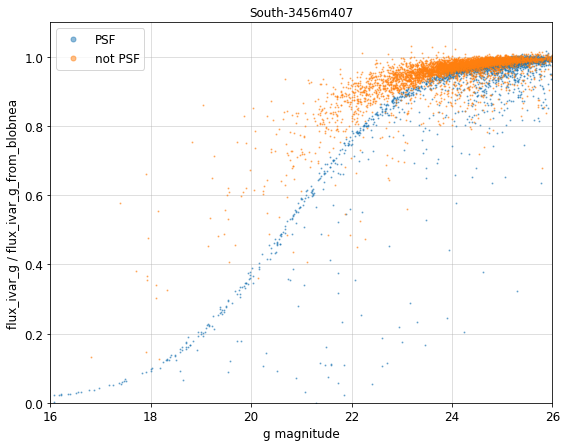

.. title: Noise Equivalent Area
.. slug: nea
.. tags: mathjax
.. description:

.. |deg|    unicode:: U+000B0 .. DEGREE SIGN
.. |Prime|    unicode:: U+02033 .. DOUBLE PRIME

.. class:: pull-right well

.. contents::

Starting with DR9, we supply a new quantity called *noise equivalent area* (NEA) in the `Tractor catalogs`_ (and downstream products).
The NEA measures the scaling between the inverse variance (IVAR) of the flux measurement and the noise level of the sky background. In units of
pixels, NEA  is defined via:

:math:`\mathrm{IVAR} \equiv 1/(\sigma_{\mathrm{pix}}^2 \times \mathrm{NEA})`    (**Eq. 1**)

where IVAR is the flux inverse variance and :math:`\sigma_{\mathrm{pix}}` is the per-pixel variance. For a single image, the
NEA can be calculated as

:math:`\mathrm{NEA} = \left(\sum\mathrm{pixel}\right)^2 / \sum\left(\mathrm{pixel}^2\right)`    (**Eq. 2**)

where pixel represents the pixel values of the model. See `King (1983)`_ for the derivation.

In theory, given the variance map and the NEA values, one can estimate the flux error of a source. One of the use cases of the NEA for
the Legacy Surveys will be to model the effects of varying depth and seeing on `DESI`_ target selection: given the "truth" photometry
from deep imaging, we can estimate the scatter in the photometry from shallower imaging using the NEA and the per-pixel depth. The NEA
can also be used to correct for offsets in the photometry due to sky-subtraction residuals. 

The utility of the NEA for predicting flux errors relies on several assumptions:

- The photometric noise is dominated by the sky background. This should hold for sources with relatively low surface brightness, *e.g.* faint galaxies.
- The pixel-level variance is constant over the extent of the source. 
- The morphology of the source is perfectly known.

.. _`Tractor catalogs`: ../catalogs
.. _`King (1983)`: https://ui.adsabs.harvard.edu/abs/1983PASP...95..163K/abstract
.. _`DESI`: https://desi.lbl.gov

Implementation Details
======================

The actual computation of the NEA is complicated by two considerations.

-------------------------

The first complication is that *Tractor* uses multiple overlapping images
that have different depth and PSF, whereas the NEA definition in **Eq. 2** only works for a single image. Therefore we instead compute an
effective NEA, which is a weighted average of the per-image NEA:

:math:`\frac{1}{\mathrm{NEA}_\mathrm{eff}} = \sum\left[ \frac{1}{(\sigma^2_{\mathrm{pix},i} \times \mathrm{NEA}_i)}\right] / \sum\left[\frac{1}{\sigma^2_{\mathrm{pix},i}}\right]`   **(Eq. 3)**

where :math:`\sigma_{\mathrm{pix},i}` is the per-image pixel-level variance and :math:`\mathrm{NEA}_i` is the per-image NEA. The derivation of :math:`\mathrm{NEA}_\mathrm{eff}` is as follows:

The inverse variance (of the flux measurement of a source) from multiple images is, by definition (see **Eq. 1**):

:math:`\mathrm{IVAR}_\mathrm{tot} \equiv \frac{1}{\sigma^2_\mathrm{pix,eff} \times \mathrm{NEA}_\mathrm{eff}}`

and, is also the sum of the per-image inverse variance:

:math:`\mathrm{IVAR}_\mathrm{tot} = \sum{\mathrm{IVAR}_i} = \sum \frac{1}{\sigma^2_{\mathrm{pix,}i} \times \mathrm{NEA}_i}`  .

In the `legacypipe`_ software used to process the Legacy Surveys imaging, the effective (combined) pixel-level variance :math:`\sigma_\mathrm{pix,eff}` is given by: 

:math:`\frac{1}{\sigma^2_\mathrm{pix,eff}} = \sum\frac{1}{\sigma^2_{\mathrm{pix,}i}}`

Combining all three of the preceding equations produces **Eq. 3**.

.. _`legacypipe`: https://github.com/legacysurvey/legacypipe

-------------------------

The second complication is that some sources are only partially covered by an image (CCD), and some sources (models) have wings that extend beyond their
blobs. Since this breaks the assumption of a constant pixel-level variance, there is no single rigorous method to compute the NEA. We therefore decided to provide
*two* versions of the NEA in the `Tractor catalogs`_:

``nea``
-------

The ``nea`` version of the NEA calculation is:

:math:`\mathtt{nea} = \sum(\frac{1}{\sigma^2_{\mathrm{pix,}i}} \times \mathrm{fracin}_i)\, / \sum(\frac{1}{\sigma^2_{\mathrm{pix,}i}} \times \mathrm{fracin}_i \times \frac{1}{\mathrm{nea}_i})`

with:

:math:`\mathrm{fracin} = \mathrm{pflux} / \mathrm{flux}`

and:

:math:`\mathrm{nea}_i = \mathrm{pflux}^2 / \sum p^2`

where `p` is the model image patch (*i.e.* the model image that overlaps the image), :math:`\mathrm{pflux}=\sum p` is the total flux in the patch, :math:`\mathrm{flux}` is the total
flux of the model (regardless of coverage), and the weight :math:`\mathrm{fracin}` is the fraction of flux in the model patch overlapping the image. In this version of the
NEA calculation, the blob mask is ignored, which makes ``nea`` less sensitive to partial coverage than ``blobnea``.

``blobnea``
-----------

The blob-masked version of the NEA calculation is:

:math:`\mathtt{blobnea} = \frac{1}{\sigma^2_\mathrm{pix,coadd}} / \sum\left(\frac{1}{\sigma^2_{\mathrm{pix,}i}} \times \frac{1}{\mathrm{mnea}_i}\right)`

with:

:math:`\mathrm{mnea}_i = \mathrm{flux}^2 / \sum \mathrm{maskedp}^2`

where :math:`\mathrm{flux}` is the total flux of the model (regardless of coverage), and :math:`\mathrm{maskedp}` is the blob-masked model image patch. The blob mask is accounted for in this
version of the NEA calculation, and, hence, the ``blobnea`` value increases with decreasing coverage. Effectively, for ``blobnea``, images with less coverage
have larger noise for the same pixel-level variance.

The ``blobnea`` values use the coadd per-pixel inverse variance in the denominator of **Eq. 3** (instead of :math:`\sum[1/\sigma^2_{\mathrm{pix,}i}]`). The
coadd per-pixel inverse variance can be obtained using the ``psfsize`` and ``psfdepth`` values from the `Tractor catalogs`_ as follows: 

:math:`1/\sigma^2_\mathrm{pix,coadd} = \mathtt{psfdepth} \times [4 \times \pi \times (\mathtt{psfsize}/2.3548)^2]`

where ``psfdepth`` is the flux IVAR of a point source (assuming sky domination), and :math:`4 \times \pi \times (\mathtt{psfsize}/2.3548)^2` is the NEA of a point
source. The quantity :math:`2.3548 = 2\sqrt{2\ln(2)}` converts the FWHM to a gaussian sigma. Here, we are just backing out the computation of
``psfsize`` to get the NEA value of the PSF.

-------------------------

The two versions of NEA agree within 1% (10%) for 90% (97%) of all sources. The ``nea`` version might be more appropriate when correcting for residual
sky background. The ``blobnea`` version should be more accurate for predicting the flux errors via:

:math:`\mathrm{flux\_ivar\_predict} = \mathtt{psfdepth} \times [4 \times \pi \times (\mathtt{psfsize}/2.3548)^2] \, / \, \mathtt{blobnea}`
      
The plot below shows a comparison between ``flux_ivar_g`` from tractor and the predicted ``flux_ivar_g`` using ``blobnea``. At bright magnitudes, the NEA
overestimates ``flux_ivar`` because the sources are bright compared to the sky (although the deviation can be easily corrected for point sources). The
agreement is better than a few percent for faint sources.

Code
====
The code used to calculate NEA for the Legacy Surveys is:

- `Per-image NEA`_
- `Averaged NEA`_

.. _`Per-image NEA`: https://github.com/legacysurvey/legacypipe/blob/ee1802c40cedfc5459d85f794fc6db10d0d2561f/py/legacypipe/runbrick.py#L1758
.. _`Averaged NEA`: https://github.com/legacysurvey/legacypipe/blob/ee1802c40cedfc5459d85f794fc6db10d0d2561f/py/legacypipe/runbrick.py#L1920
