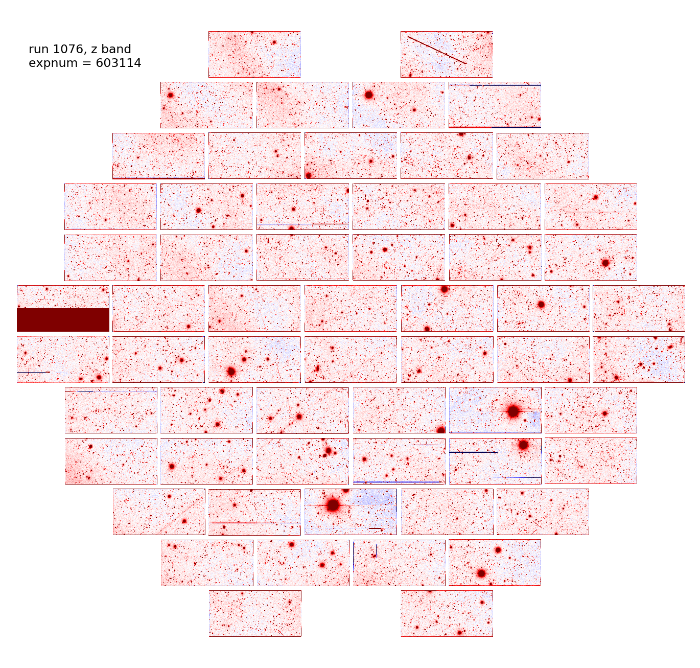
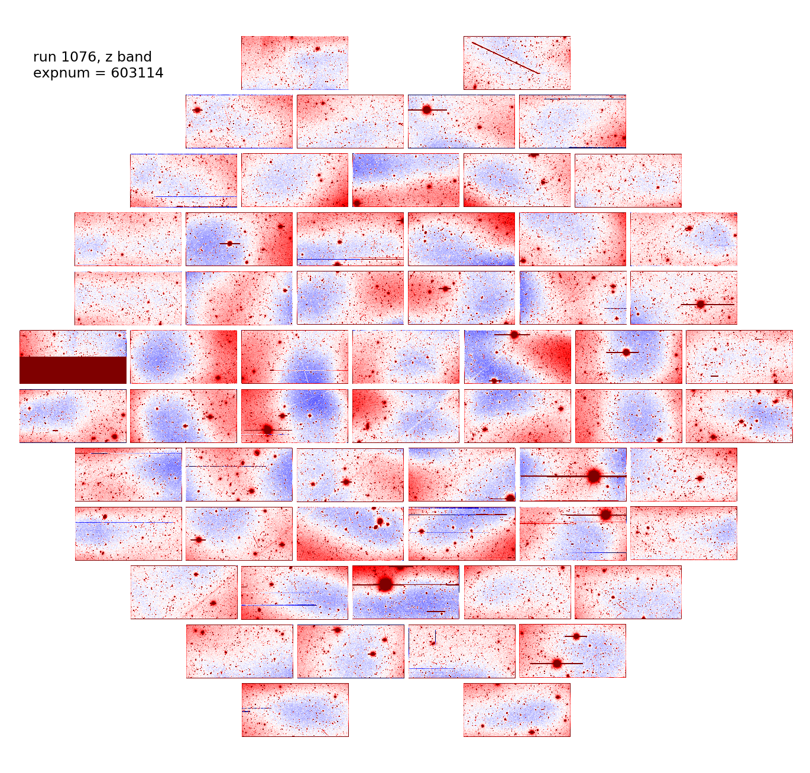
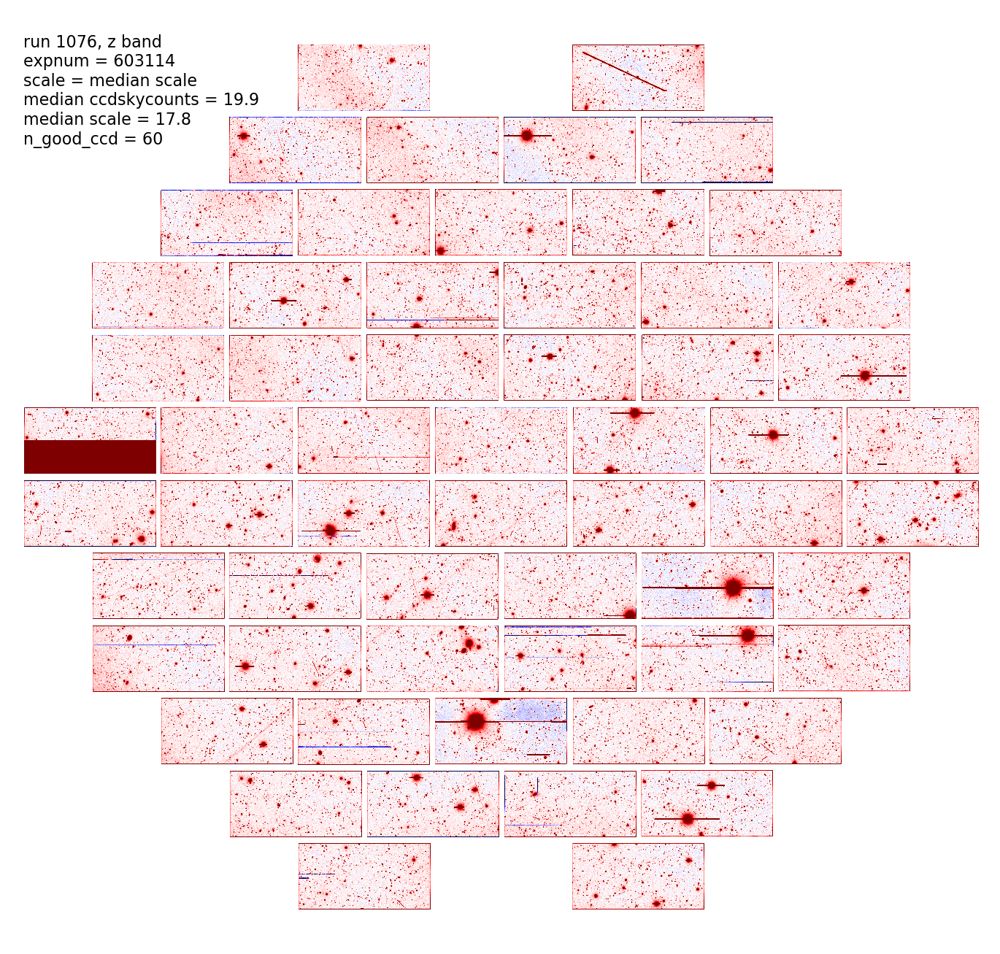
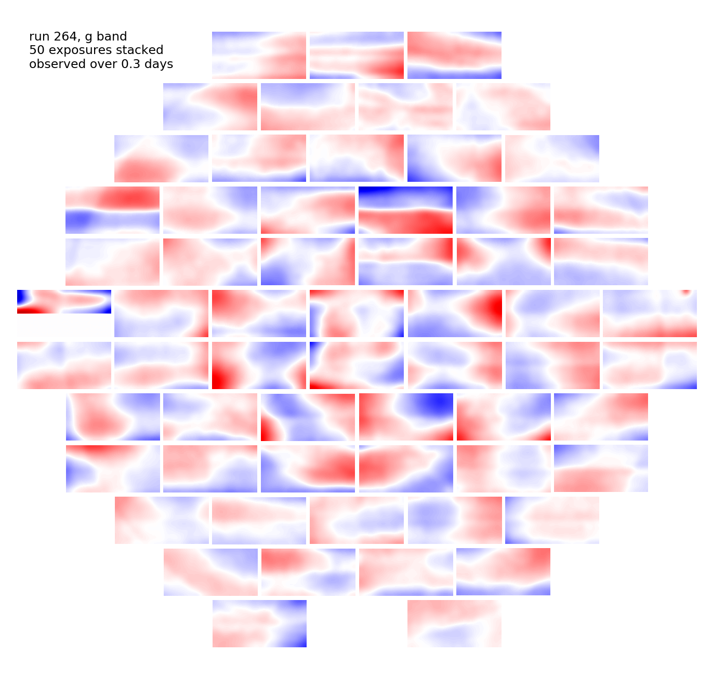
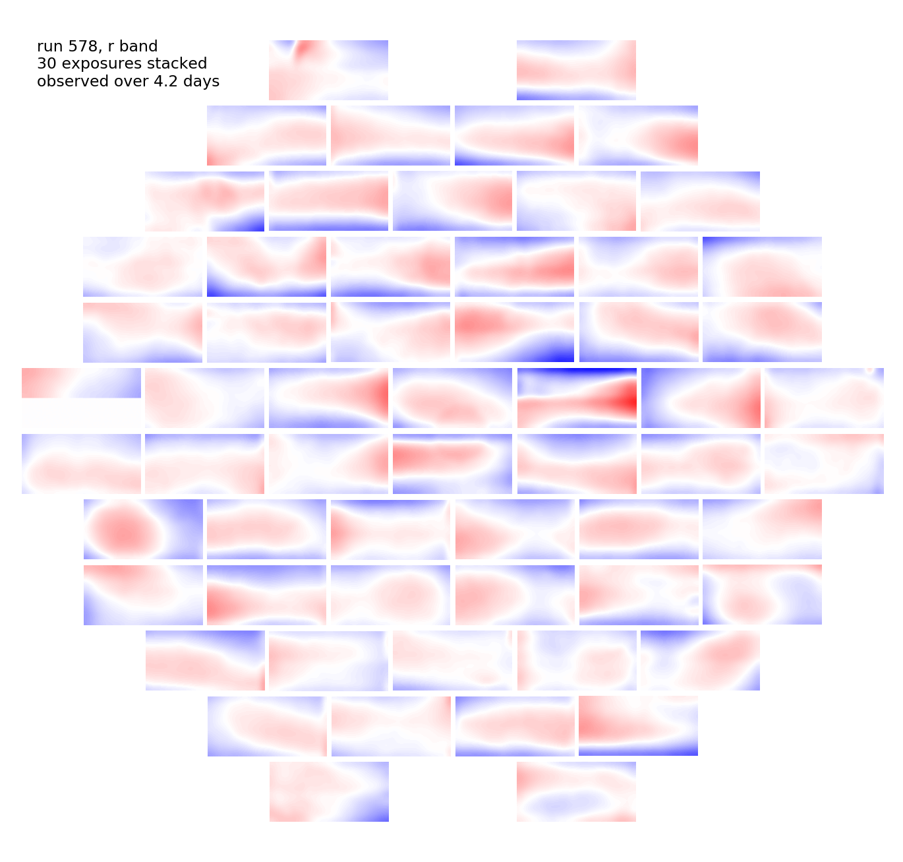
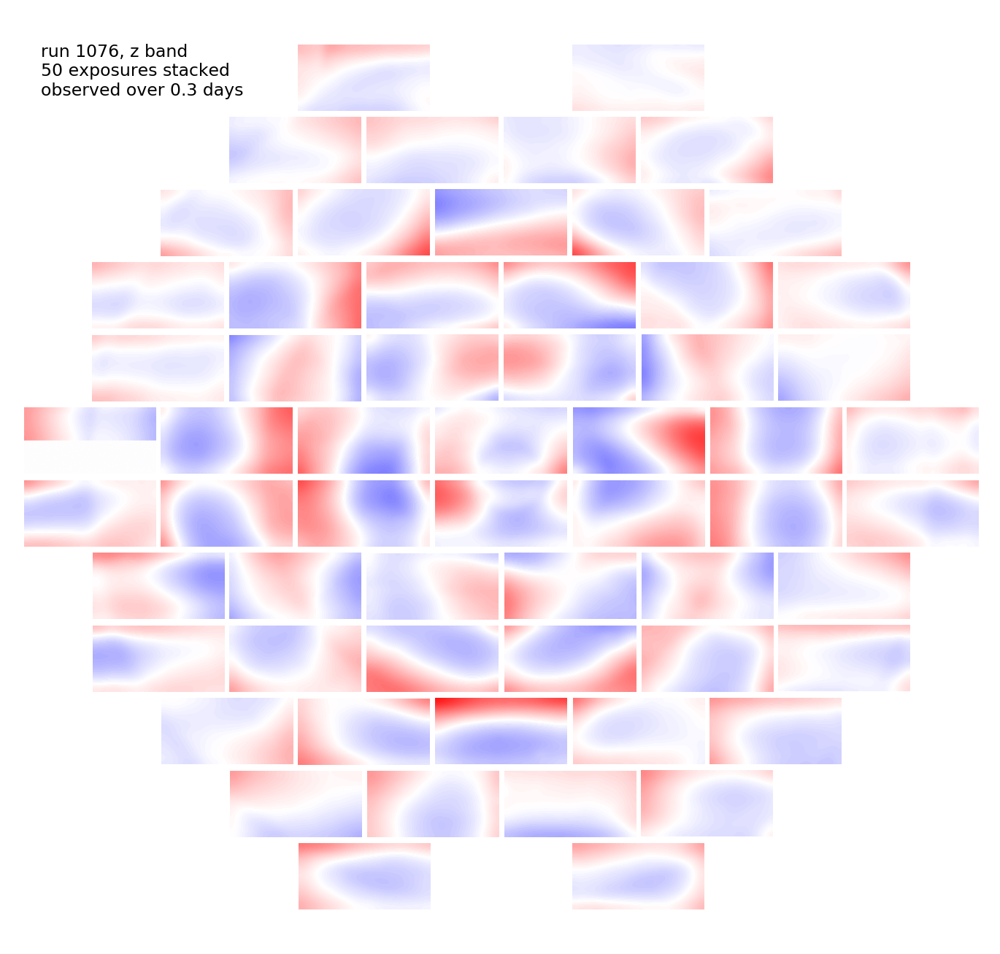

.. title: Sky Pattern Correction
.. slug: sky
.. tags: 
.. has_math: yes

.. |deg|    unicode:: U+000B0 .. DEGREE SIGN
.. |Prime|    unicode:: U+02033 .. DOUBLE PRIME

.. class:: pull-center well

.. contents::

*Page author and contact:* `Rongpu Zhou`_

.. _`Rongpu Zhou`: ../../contact/#other-experts

Changes in the `DECam Community Pipeline`_ (henceforth CP) between `DR8`_ and `DR9`_ of the Legacy Surveys (in particular the switch from dark sky flats to `DES`_
star flats) led to residual sky patterns with a sufficiently high amplitude to, *e.g.*, significantly impact `DESI target selection`_. The
sky residual patterns exist in all three bands (:math:`grz`), with the :math:`z\hbox{-}\mathrm{band}` having the worst residuals. So, starting
with `DR9`_, we additionally correct `DECaLS`_ images to account for the residual sky pattern from the `CP`_. Below, we include some representative
:math:`z\hbox{-}\mathrm{band}` exposures from `DR8`_ imaging, and from `DR9`_ imaging before and after applying the sky correction described on this page:

.. _`DECam Community Pipeline`: https://legacy.noirlab.edu/noao/staff/fvaldes/CPDocPrelim/PL201_3.html
.. _`CP`: https://legacy.noirlab.edu/noao/staff/fvaldes/CPDocPrelim/PL201_3.html
.. _`DR8`: ../../dr8
.. _`DR9`: ../../dr9
.. _`DES`: https://www.darkenergysurvey.org
.. _`DESI target selection`: https://github.com/desihub/desitarget
.. _`DECaLS`: ../../decamls

Sky templates
=============

The residual sky patterns are usually very stable for many nights. Therefore we correct for the sky patterns using sky templates that are generated for each night
or multiple consecutive nights depending on the number of exposures available. All the DR9 exposures are grouped into "runs" of adjacent exposures of the same
filter, and a sky template is generated for each run. We require that each run has at least 25 exposures that meet our quality cuts (described below), and if a
night has insufficient exposures, the next (or a later) night is included until there are at least 25 exposures.

We also apply quality cuts for exposures to be used in stacking. We require that an exposure is not too close to another exposure in the run, that it meets
some depth cut, and that it doesn't have too many bad CCDs. Images with ``PLVER=4.1`` are excluded from template creation and from sky pattern correction, because
such images used the older version of the `CP`_ sky-subtraction code and so are not affected by the residual patterns. Before stacking,
the images are normalized by the median of the ``ccdskycounts`` value from all CCDs that cover the exposure of interest, and all `DR8`_ sources (blobs) are
masked. Note that the `CP`_ ``ood`` mask is *not* applied.

Finally, we obtain the sky templates by median-stacking the images and smoothing them with a Gaussian filter of :math:`\sigma=120\,\mathrm{pixels}`. Up to 50
exposures are used in the stack due to memory limitations. All the templates are visually inspected, and some of the problematic templates are regenerated
after rejecting bad exposures, such as those that are contaminated by bright stars or satellite trails. Some example final sky templates are below for (from
left-to-right) :math:`g\hbox{-}\mathrm{band}`, :math:`r\hbox{-}\mathrm{band}` and :math:`z\hbox{-}\mathrm{band}`:

Each blob-masked CCD image is fit with its corresponding template, and the median scale over the exposure (rather than, *i.e.* the per-CCD scale) is used
to apply the sky correction. For exposures outside the `DR8`_ footprint or that cover fewer than 10 CCDs that have per-CCD fits, we use the median
``ccdskycounts`` value over the exposure as the sky scale.

The sky-corrected image can be calculated as:

:math:`\mathrm{image\_corrected} = \mathrm{image\_original} - \mathrm{skyscale} \times \mathrm{template}`

Special steps were taken for certain :math:`r\hbox{-}\mathrm{band}` images that were affected by edge glow in early DECam exposures. In addition, the following
`DECam CCDs`_ also undergo special handling:

- ``N10`` (because for certain nights, only half of the CCD is stable)
- ``N15`` (because it is tarnished by a large hot spot on some nights)
- ``S7`` (because only half of the CCD is usable)
- ``S30`` (this CCD was disabled, and produced bad images around the time when it came back online)

Code
====
The code used to correct for sky patterns for DR9 of the Legacy Surveys is `available on GitHub`_.

.. _`available on GitHub`: https://github.com/rongpu/desi-misc/tree/master/sky_pattern
.. _`DECam CCDs`: https://noirlab.edu/science/programs/ctio/instruments/Dark-Energy-Camera/characteristics

Additional Information and Products
===================================
Some additional plots characterizing the `DECaLS`_ DR9 sky corrections are available for DESI collaborators `on the wiki`_.
The various files generated to make the sky corrections are also available at NERSC:

- Sky runs: ``/global/cfs/cdirs/desi/users/rongpu/dr9/sky_pattern/skyrunsgoodcountexpnumv48dr8.fits``
- Sky templates: ``/global/cfs/cdirs/cosmo/work/legacysurvey/dr9m/calib/sky_pattern/sky_templates``
- Per-exposure sky scales: ``/global/cfs/cdirs/cosmo/work/legacysurvey/dr9m/calib/sky_pattern/sky-scales.fits``

.. _`on the wiki`: https://desi.lbl.gov/trac/wiki/DecamLegacy/DR9/SkyPatternCorrection
